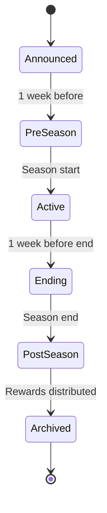

# DC Seasons System Evaluation
## 2026 Improvements Analysis

**Files Analyzed:** 8 files (140KB+ total)
**Last Analyzed:** January 1, 2026

---

## System Overview

The Seasons system provides a framework for time-limited competitive periods with unique rewards, affecting multiple game systems.

### Core Components
| File | Size | Purpose |
|------|------|---------|
| `SeasonalSystem.cpp` | 24KB | Season lifecycle management |
| `SeasonalRewardSystem.cpp` | 44KB | Reward distribution |
| `SeasonalSystem.h` | 11KB | Core definitions |
| `SeasonalRewardSystem.h` | 9KB | Reward interfaces |
| `HLBGSeasonalParticipant.cpp` | 21KB | HLBG season integration |

---

## 🔴 Issues Found

### 1. **Multiple System Registration Patterns**
Different subsystems register differently:
```cpp
// SeasonalSystem.cpp - manual registration
bool RegisterSystem(const SystemRegistration& system)

// HLBGSeasonalParticipant.cpp - implicit registration
// No explicit registration call
```
**Recommendation:** Standardize registration with auto-discovery.

### 2. **Season Transition Race Conditions**
```cpp
bool TransitionSeason(uint32 from_season_id, uint32 to_season_id)
{
    EndSeason(from_season_id);  // What if this fails?
    StartSeason(to_season_id);  // New season started with old state
}
```
**Recommendation:** Use database transaction for atomic transition.

### 3. **No Maintenance Window**
Seasons end/start instantly. Players mid-activity lose progress.
**Recommendation:** Add grace period and maintenance mode.

### 4. **Hardcoded Season Event Types**
```cpp
enum SeasonEventType { START, END, TRANSITION };
// No extension points
```
**Recommendation:** Add generic event system with custom payloads.

---

## 🟡 Improvements Suggested

### 1. **Season Preview**
Show upcoming season details before it starts:
- New affixes
- New rewards
- Featured dungeons
- Rule changes

### 2. **Season Pass System**
Progressive reward track:
```cpp
struct SeasonPass {
    uint8 tier;  // Free or Premium
    uint32 currentXP;
    uint32 level;  // 1-100
    std::vector<uint32> claimedRewards;
};
```

### 3. **Catch-Up Mechanics**
Late joiners get XP boost:
- Week 1-4: Normal rate
- Week 5-8: 25% bonus
- Week 9-12: 50% bonus
- Week 13+: 100% bonus

### 4. **Season Achievements**
Per-season achievements:
- Complete all M+15s
- Reach 2000 HLBG rating
- Upgrade all gear to Tier 4
- Unlock all seasonal transmog

### 5. **Historical Season Browser**
View past season stats and rewards:
```cpp
struct SeasonHistory {
    uint32 seasonId;
    uint32 playerRating;
    uint8 rewardTier;
    std::vector<uint32> achievementsEarned;
};
```

---

## 🟢 Extensions Recommended

### 1. **Season Themes**
Visual/audio changes per season:
- Login screen
- Capital city decorations
- NPC dialogue variations
- Zone weather effects

### 2. **Faction Season Wars**
Cross-faction competition:
- Aggregate faction scores
- Winning faction gets bonus
- Seasonal world objectives

### 3. **Seasonal Leaderboard Snapshots**
Preserve end-of-season rankings:
```sql
CREATE TABLE dc_season_leaderboard_snapshot (
    season_id INT,
    category VARCHAR(32),
    player_guid INT,
    final_rank INT,
    final_score INT,
    snapshot_time DATETIME
);
```

### 4. **Season Challenges**
Weekly rotating challenges:
- Speed run bonus
- No death bonus
- Undergeared bonus

### 5. **Legacy Seasons**
Allow playing old season content:
- Timewalking seasons
- Hardmode replays

---

## 📊 Technical Upgrades

### Season State Machine



### Database Enhancements
```sql
-- Add season phases
ALTER TABLE dc_seasons 
ADD COLUMN phase ENUM('announced', 'preseason', 'active', 'ending', 'postseason', 'archived'),
ADD COLUMN announce_time DATETIME,
ADD COLUMN preseason_start DATETIME;

-- Season participation tracking
CREATE TABLE dc_season_participation (
    player_guid INT,
    season_id INT,
    first_activity DATETIME,
    last_activity DATETIME,
    total_play_time INT,
    PRIMARY KEY (player_guid, season_id)
);
```

---

## Integration Points

| System | Integration | Quality |
|--------|------------|---------|
| MythicPlus | Full scoring | ⭐⭐⭐⭐⭐ |
| HLBG | Full rewards | ⭐⭐⭐⭐⭐ |
| ItemUpgrades | Currency bonuses | ⭐⭐⭐⭐ |
| GreatVault | Seasonal rewards | ⭐⭐⭐⭐ |
| Prestige | Bonus multipliers | ⭐⭐⭐ |
| Leaderboards | Rankings | ⭐⭐⭐⭐⭐ |

---

## Priority Actions

1. **HIGH:** Fix season transition atomicity
2. **HIGH:** Add maintenance window
3. **MEDIUM:** Standardize system registration
4. **MEDIUM:** Add catch-up mechanics
5. **LOW:** Season pass system
6. **LOW:** Legacy seasons
