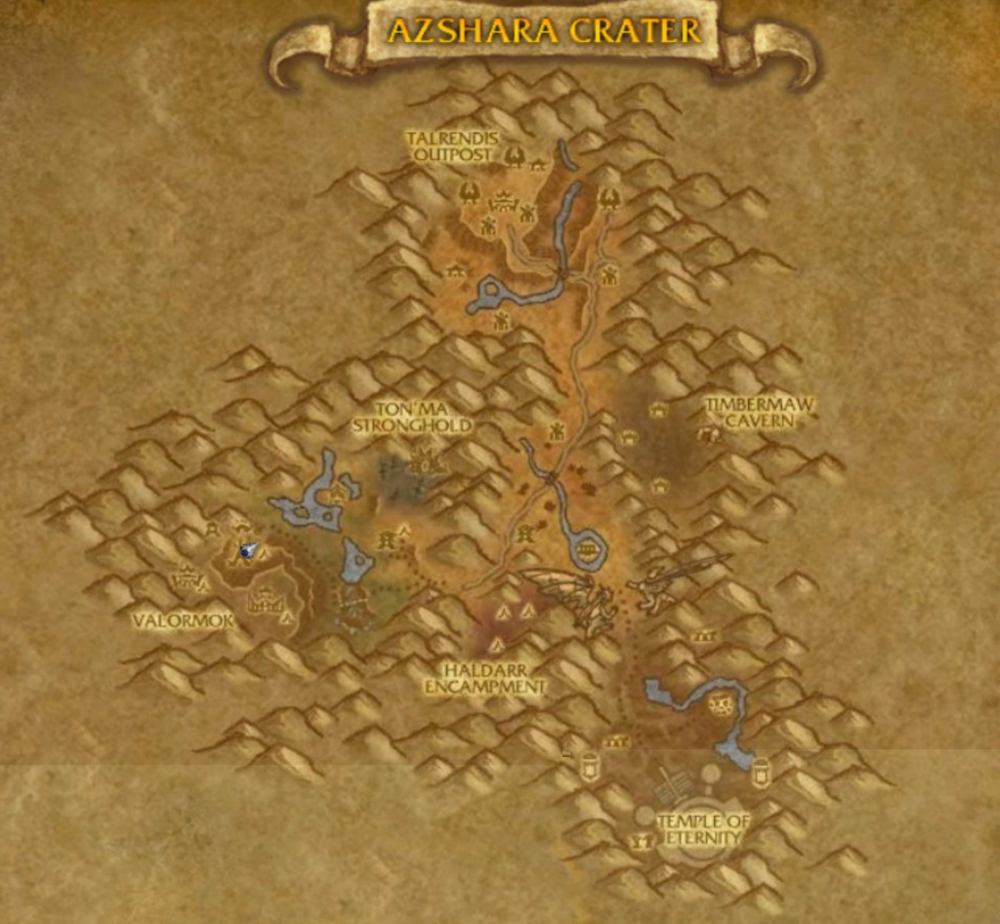
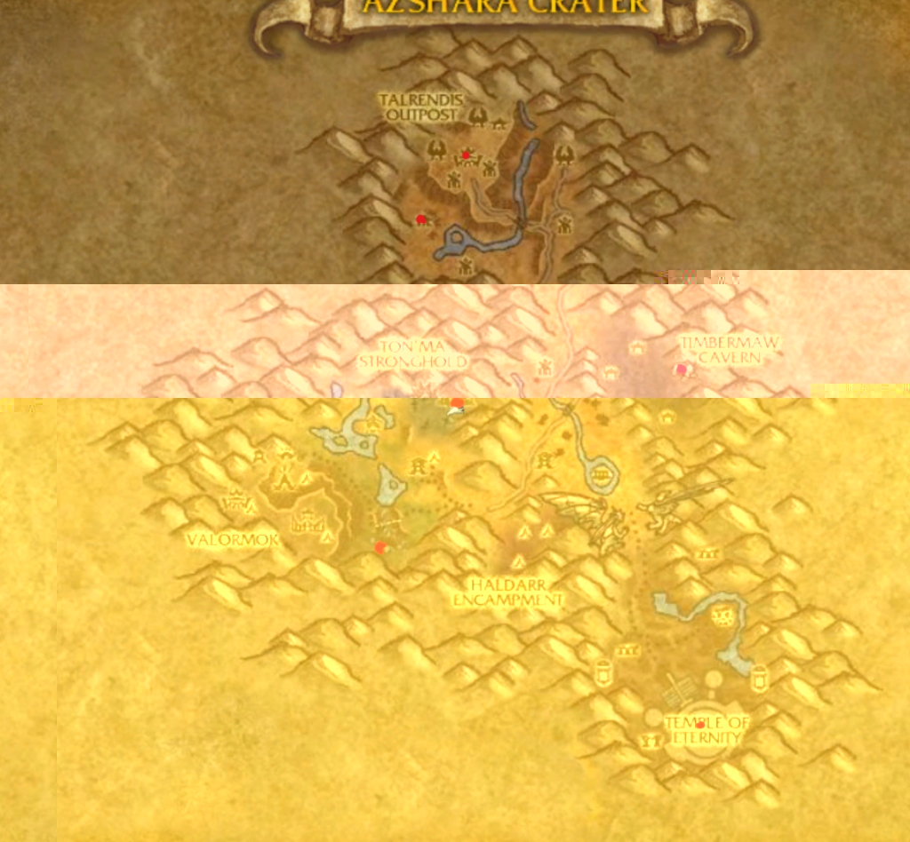
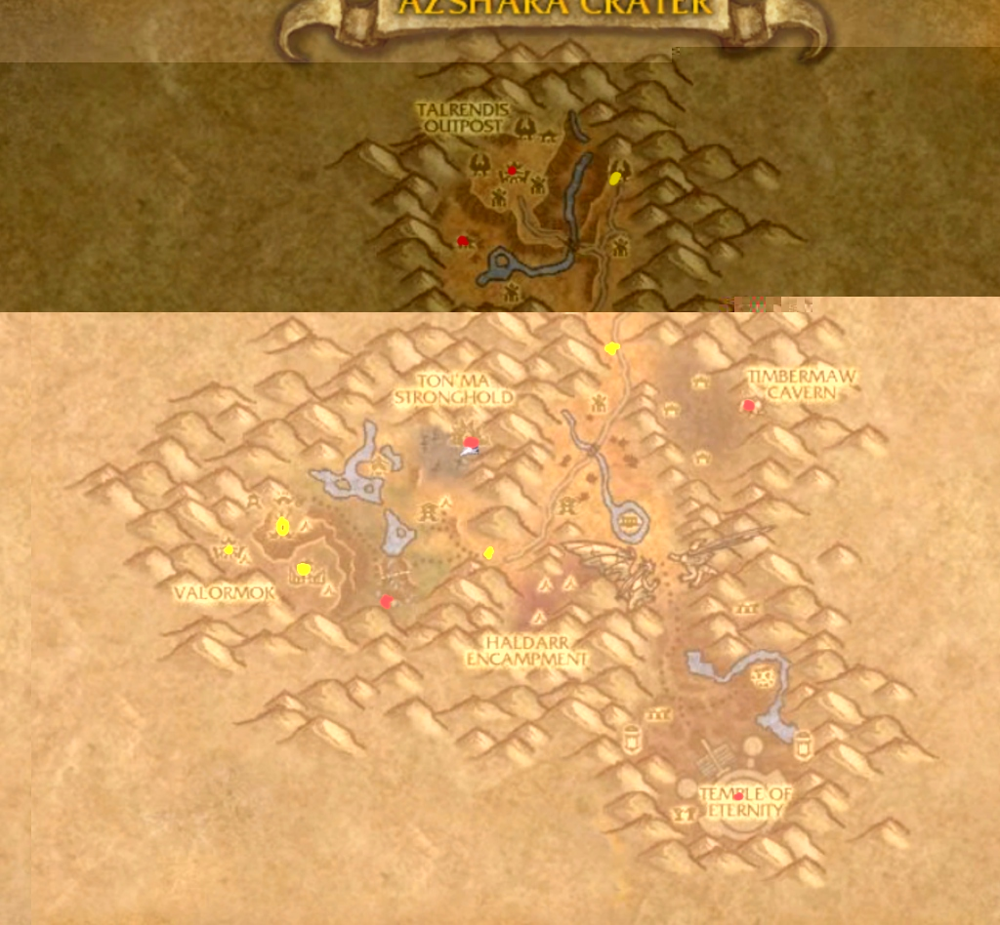

# Azshara Crater Leveling Zone Evaluation
## Level 1-80 | DC-WoW AzerothCore 3.3.5a

> [!NOTE]
> This is **before Hyjal** in the leveling progression: Azshara Crater (1-80) → Hyjal Summit (80-130) → Stratholme (130-160).

---

## Table of Contents
1. [Zone Concept Map](#zone-concept-map)
2. [Total Content Summary](#total-content-summary)
3. [Zone Overview & Lore](#zone-overview--lore)
4. [Leveling Tiers (8 Zones)](#leveling-tiers-8-zones)
5. [Mini-Dungeons (5 Locations)](#mini-dungeons-5-locations)
6. [NPCs & Bestiary](#npcs--bestiary)
7. [World Bosses](#world-bosses)
8. [Faction Bases](#faction-bases)
9. [Special Features](#special-features)

---

## Zone Concept Map







> [!TIP]
> For detailed NPC lists including dungeon mobs and bosses, see [NPC_OVERVIEW_azshara_crater.md](NPC_OVERVIEW_azshara_crater.md)

### Zone Layout Overview
The map shows a **crater basin** surrounded by mountains with:

**Combined Faction Bases (Yellow Markers):**
- **Valormok** (Southwest) - **MAIN STARTING POINT** - Both factions
- **Ton'ma Stronghold** (Center) - Central hub for mid-levels
- **Northern Checkpoint** (North) - Early game rest stop
- **Eastern Outpost** (East, near Timbermaw) - Furbolg ally base
- **Temple Approach** (Southeast) - Endgame base

**Dungeon Locations (Red Markers):**
- **Ruins of Zin-Azshari** (North) - Level 15-25
- **Timbermaw Deep** (Northeast) - Level 25-35
- **Spitelash Depths** (Central) - Level 45-55
- **The Fel Pit** (South-Center) - Level 55-65
- **Sanctum of the Highborne** (Southeast) - Level 75-80

### Level Zone Distribution
Higher levels require **exponentially more XP**, so higher-tier zones are **larger** and have **more content**.


### The "Crater Conquest" Safe Road
A distinct **Safe Road** (marked in grey on the map) connects all major faction bases, allowing players to traverse the zone without entering dangerous high-level areas prematurely.
*   **Route:** Start at **Valormok (SW)** -> Safe valley pass to **Ton'ma Stronghold (Center)** -> North to **Northern Ruins** -> East to **Timbermaw Slopes** -> South to **Temple of Eternity**.
*   **Safety:** The road is patrolled by faction guards and avoids the center of the high-level Dragon Coast and Western Cliffs.


---

## Total Content Summary

| Category | Count | Notes |
|----------|-------|-------|
| **Leveling Zones** | **8** | Scaled by XP requirements |
| **Combined Bases** | **5** | Yellow markers on map |
| **Leveling Enemies** | **~40** | Using existing WotLK creatures |
| **Zone Rares** | **8** | Using existing rare NPCs |
| **Mini-Dungeons** | **5** | 5 trash + 1 boss each |
| **Dungeon NPCs** | **30** | All existing WotLK entry IDs |
| **World Bosses** | **4** | One per major tier |
| **Base NPCs** | **~50** | Quest givers, vendors, trainers |
| **Total Unique NPCs** | **~130** | All existing creatures |

> [!IMPORTANT]
> **All NPCs use existing WotLK 3.3.5a creature entry IDs.** See [NPC_OVERVIEW_azshara_crater.md](NPC_OVERVIEW_azshara_crater.md) for the complete list with entry IDs.

---

## Zone Overview & Lore

### Historical Background
**Azshara Crater** was originally planned as a **cancelled battleground** in WoW's development history, located in the **Forlorn Ridge** area of southern Azshara. The terrain exists in-game but was never populated.

### Original Lore (Pre-Sundering)
- Part of the ancient Night Elven capital **Zin-Azshari**
- Home to Queen Azshara's Highborne followers
- Shattered during the Great Sundering when the Well of Eternity exploded
- Survivors transformed into **Naga** or became **ghosts** haunting the ruins

### Zone Inhabitants (Blizzlike WotLK)
| Faction | Role | Theme |
|---------|------|-------|
| **Naga** | Primary antagonists | Servants of Queen Azshara |
| **Satyr (Haldarr/Legashi)** | Demonic corrupted elves | Shadow & fel magic |
| **Highborne Ghosts** | Undead threat | Arcane magic & tragedy |
| **Timbermaw Furbolgs** | Neutral to friendly | Nature guardians |
| **Blue Dragonflight** | Elite enemies | Arcane protectors |
| **Wildlife** | Ambient/low level | Bears, wolves, basilisks |

### Design Philosophy
**"The Crater Conquest"** - Players start at **Valormok** (southwest) and radiate outward through the crater. The progression moves from the safe base through increasingly dangerous zones toward the **Temple of Eternity** in the southeast, which represents the ancient heart of Zin-Azshari's power.

---

## Leveling Tiers (8 Zones)

### Zone Size Scaling Formula
XP required **doubles** roughly every 10 levels. Zone sizes scale accordingly:

| Zone | Levels | Relative Size | NPCs | Area | Base |
|------|--------|---------------|------|------|------|
| 1 | 1-10 | Small (1x) | 15 | Valormok Rim | ★ Valormok (Start) |
| 2 | 10-20 | Medium (1.5x) | 20 | Northern Ruins | Northern Checkpoint |
| 3 | 20-30 | Medium (1.5x) | 20 | Timbermaw Slopes | Eastern Outpost |
| 4 | 30-40 | Medium-Large (2x) | 25 | Central Valley | ★ Ton'ma Stronghold |
| 5 | 40-50 | Large (2.5x) | 25 | Western Cliffs | - |
| 6 | 50-60 | Large (2.5x) | 30 | Haldarr Territory | - |
| 7 | 60-70 | Very Large (3x) | 35 | Dragon Coast | - |
| 8 | 70-80 | Massive (4x) | 40 | Temple of Eternity | ★ Temple Approach |

---

### Zone 1: Valormok Rim (Level 1-10)
*Starting Zone - "The First Steps"*

**Location:** Southwest area around Valormok (Main Starting Base)
**Theme:** Safe wilderness, wildlife threats, basic questing
**Base:** ★ **Valormok** - Combined faction starting point

#### Enemies (Verified WotLK IDs)
| NPC Name | Entry ID | Level | Type | Spawn Count |
|----------|----------|-------|------|-------------|
| Young Thistle Boar | **1984** | 2-4 | Beast | 15 |
| Rabid Thistle Bear | **2164** | 4-6 | Beast | 12 |
| Crater Wolf | **2728** | 5-7 | Beast | 10 |
| Highborne Wisp | **7849** | 6-8 | Elemental | 8 |
| Giant Webwood Spider | **1985** | 8-10 | Beast | 8 |

---

### Zone 2: Northern Ruins (Level 10-20)
*"Echoes of the Highborne"*

**Location:** Ruins northeast of Talrendis
**Theme:** First encounters with Highborne ghosts and mysteries

#### Enemies (Verified WotLK IDs)
| NPC Name | Entry ID | Level | Type | Spawn Count |
|----------|----------|-------|------|-------------|
| Highborne Apparition | **7971** | 12-14 | Undead | 15 |
| Highborne Lichling | **7972** | 14-16 | Undead | 12 |
| Lingering Highborne | **7973** | 16-18 | Undead | 10 |
| Arcane Anomaly | **18429** | 17-19 | Elemental | 8 |
| Cursed Sentry | **7148** | 18-20 | Construct | 6 |

---

### Zone 3: Timbermaw Slopes (Level 20-30)
*"Furbolg Territory"*

**Location:** Eastern slopes near Timbermaw Cavern
**Theme:** Corrupted furbolgs, nature corruption storyline

#### Enemies (Verified WotLK IDs)
| NPC Name | Entry ID | Level | Type | Spawn Count |
|----------|----------|-------|------|-------------|
| Timbermaw Pathfinder | **7156** | 22-24 | Humanoid | 12 |
| Timbermaw Warrior | **7157** | 24-26 | Humanoid | 10 |
| Timbermaw Shaman | **7158** | 25-27 | Humanoid | 8 |
| Deadwood Shaman | **7155** | 26-28 | Humanoid | 10 |
| Deadwood Avenger | **7153** | 28-30 | Humanoid | 8 |

---

### Zone 4: Central River Valley (Level 30-40)
*"The Contested Grounds"*

**Location:** Central area around Ton'ma Stronghold, river system
**Theme:** Faction conflict (Horde vs Naga), first Naga encounters

#### Enemies (Verified WotLK IDs)
| NPC Name | Entry ID | Level | Type | Spawn Count |
|----------|----------|-------|------|-------------|
| Spitelash Warrior | **6190** | 32-34 | Humanoid | 15 |
| Spitelash Myrmidon | **6193** | 34-36 | Humanoid | 12 |
| Spitelash Siren | **6195** | 35-37 | Humanoid | 10 |
| Spitelash Screamer | **6196** | 37-39 | Humanoid | 8 |
| Makrura Shellhide | **6348** | 38-40 | Humanoid | 8 |

---

### Zone 5: Valormok Region (Level 40-50)
*"The Horde Frontier"*

**Location:** Western cliffs around Valormok outpost
**Theme:** Satyr corruption, demon influence begins

#### Enemies (Verified WotLK IDs)
| NPC Name | Entry ID | Level | Type | Spawn Count |
|----------|----------|-------|------|-------------|
| Wildspawn Satyr | **11451** | 42-44 | Demon | 12 |
| Wildspawn Shadowstalker | **11452** | 44-46 | Demon | 10 |
| Wildspawn Felsworn | **11453** | 46-48 | Demon | 8 |
| Felpaw Ravager | **5866** | 45-47 | Demon | 10 |
| Felhound | **5865** | 48-50 | Demon | 8 |

---

### Zone 6: Haldarr Territory (Level 50-60)
*"The Demon Gate"*

**Location:** Southern central area around Haldarr Encampment
**Theme:** Full satyr territory, fel corruption spreading

#### Enemies (Verified WotLK IDs)
| NPC Name | Entry ID | Level | Type | Spawn Count |
|----------|----------|-------|------|-------------|
| Legashi Satyr | **6133** | 52-54 | Demon | 15 |
| Legashi Rogue | **6134** | 54-56 | Demon | 12 |
| Legashi Hellcaller | **6135** | 56-58 | Demon | 10 |
| Felguard Sentry | **8716** | 57-59 | Demon | 8 |
| Doomguard Commander | **7671** | 58-60 | Demon | 4 |

---

### Zone 7: Southern Highlands (Level 60-70)
*"Dragon Coast"*

**Location:** Southern mountains, coastal areas, dragon territory
**Theme:** Blue Dragonflight, Naga high command, ancient magic

#### Enemies (Verified WotLK IDs)
| NPC Name | Entry ID | Level | Type | Spawn Count |
|----------|----------|-------|------|-------------|
| Azure Whelpling | **6130** | 62-64 | Dragon | 15 |
| Azure Drake | **6129** | 64-66 | Dragon | 10 |
| Azure Templar | **12461** | 66-68 | Dragon | 6 |
| Naga Explorer | **6065** | 65-68 | Humanoid | 10 |
| Mana Surge | **15527** | 68-70 | Elemental | 8 |

---

### Zone 8: Temple of Eternity (Level 70-80)
*"Heart of Zin-Azshari" - Final Leveling Zone*

**Location:** Southeastern ruins, ancient temple complex
**Theme:** Highborne elite, Old God whispers, endgame preparation

> [!WARNING]
> This zone prepares players for **Hyjal Summit (80-130)**. Difficulty scales to match WotLK endgame expectations.

#### Enemies (Verified WotLK IDs)
| NPC Name | Entry ID | Level | Type | Spawn Count |
|----------|----------|-------|------|-------------|
| Highborne Apparition | **7971** | 72-74 | Undead | 12 |
| Arcane Guardian | **15691** | 74-76 | Construct | 8 |
| Mana Remnant | **5766** | 76-78 | Elemental | 10 |
| Faceless Lurker | **27099** | 78-80 | Aberration | 6 |
| Forgotten One | **27959** | 79-80 | Aberration | 4 |

---

## Mini-Dungeons (5 Locations)

> [!TIP]
> Each dungeon has **5 trash mobs** (mix of normal + elite) and **1 boss**. All use **existing WotLK creature entry IDs**. Full details in [NPC_OVERVIEW_azshara_crater.md](NPC_OVERVIEW_azshara_crater.md)

```
DUNGEON LOCATION MAP
═══════════════════════════════════════════════════════════
       ★D1 (Ruins)                    
         │                             ★D2 (Timbermaw)
         │                                  │
         └──────────┬───────────────────────┘
                    │    
              ★D3 (Naga Temple)
                    │
              ★D4 (Fel Pit)
                    │
              ★D5 (Sanctum)
═══════════════════════════════════════════════════════════
```

---

### ★D1: Ruins of Zin-Azshari (Level 15-25)
**Location:** Northern Ruins | **Theme:** Highborne ghosts

| Type | NPC Name | Entry ID | Level | Elite |
|------|----------|----------|-------|-------|
| Trash | Highborne Apparition | **7971** | 18 | No |
| Trash | Highborne Lichling | **7972** | 19 | No |
| Trash | Lingering Highborne | **7973** | 20 | **Yes** |
| Trash | Shade of Elura | **8521** | 18 | No |
| Trash | Shadowsong Zealot | **11479** | 21 | **Yes** |
| **Boss** | **Varo'then's Ghost** | **7970** | 25 | **Elite** |

**Boss Mechanics:** Shadow Bolt Volley, Fear, Phase Shift
**Loot:** Blue cloth/leather gear

---

### ★D2: Timbermaw Deep (Level 25-35)
**Location:** Timbermaw Cavern | **Theme:** Corrupted furbolgs

| Type | NPC Name | Entry ID | Level | Elite |
|------|----------|----------|-------|-------|
| Trash | Timbermaw Pathfinder | **7156** | 28 | No |
| Trash | Timbermaw Warrior | **7157** | 29 | **Yes** |
| Trash | Timbermaw Shaman | **7158** | 28 | No |
| Trash | Deadwood Shaman | **7155** | 30 | No |
| Trash | Deadwood Avenger | **7153** | 32 | **Yes** |
| **Boss** | **Overlord Ror** | **11605** | 35 | **Elite** |

**Boss Mechanics:** Nature's Wrath, Frenzy at 30%, summons treant
**Loot:** Blue mail + Timbermaw reputation

---

### ★D3: Spitelash Depths (Level 45-55)
**Location:** South of Ton'ma | **Theme:** Underwater naga

| Type | NPC Name | Entry ID | Level | Elite |
|------|----------|----------|-------|-------|
| Trash | Spitelash Warrior | **6190** | 48 | No |
| Trash | Spitelash Myrmidon | **6193** | 49 | **Yes** |
| Trash | Spitelash Siren | **6195** | 48 | No |
| Trash | Spitelash Screamer | **6196** | 50 | No |
| Trash | Makrura Shellhide | **6348** | 49 | **Yes** |
| **Boss** | **Duke Hydraxis** | **13278** | 55 | **Elite** |

**Boss Mechanics:** Frost AoE, summons water adds, Whirlpool
**Loot:** Blue weapons

---

### ★D4: The Fel Pit (Level 55-65)
**Location:** Haldarr Encampment | **Theme:** Demonic summoning

| Type | NPC Name | Entry ID | Level | Elite |
|------|----------|----------|-------|-------|
| Trash | Legashi Satyr | **6133** | 58 | No |
| Trash | Legashi Rogue | **6134** | 59 | No |
| Trash | Legashi Hellcaller | **6135** | 60 | **Yes** |
| Trash | Felguard Sentry | **8716** | 58 | No |
| Trash | Doomguard Commander | **7671** | 62 | **Yes** |
| **Boss** | **Sethir the Ancient** | **6909** | 65 | **Elite** |

**Boss Mechanics:** Shadow Bolt Volley, summons Felhound pack, Curse
**Loot:** Fel-themed blues

---

### ★D5: Sanctum of the Highborne (Level 75-80)
**Location:** Temple of Eternity | **Theme:** Ancient throne room

> [!WARNING]
> Final dungeon - hardest pre-Hyjal content

| Type | NPC Name | Entry ID | Level | Elite |
|------|----------|----------|-------|-------|
| Trash | Arcane Guardian | **15691** | 77 | **Yes** |
| Trash | Mana Remnant | **5766** | 76 | No |
| Trash | Faceless Lurker | **27099** | 78 | **Yes** |
| Trash | Highborne Apparition | **7971** | 75 | No |
| Trash | Forgotten One | **27959** | 79 | **Yes** |
| **Boss** | **Azuregos** | **6109** | 80 | **Elite** |

**Boss Mechanics:** Arcane Barrage, Mind Control, Void zones, "Azshara's Wrath" (interrupt)
**Loot:** Pre-Hyjal epics

---

## World Bosses

### 1. Scalebearer Malaxion (Weekly)
*The Dragon Guardian*
- **Level:** 75 Elite
- **Location:** Southern Highlands
- **Loot:** Blue Dragonflight mounts, epic weapons

### 2. Xal'athos the Pit Lord (Bi-Weekly)
*Lord of Corruption*
- **Level:** 65 Elite
- **Location:** Haldarr Territory
- **Loot:** Fel-themed armor sets

### 3. The Sea King (Weekly)
*Ancient Naga*
- **Level:** 55 Elite
- **Location:** Central River (underwater spawn)
- **Loot:** Aquatic mounts, Naga artifacts

### 4. Varo'then Reborn (Rare Event)
*Shadow of the Past*
- **Level:** 80 Elite
- **Location:** Temple of Eternity
- **Loot:** Legendary crafting materials, cosmetics

---

## Combined Faction Bases

> [!NOTE]
> All bases are **combined** - both Alliance and Horde players welcome. Full NPC details in [NPC_OVERVIEW_azshara_crater.md](NPC_OVERVIEW_azshara_crater.md)

### ★ Base 1: Valormok (Main Starting Base)
**Location:** Southwest | **Level Range:** 1-10

| NPC | Role | Faction |
|-----|------|--------|
| **Commander Bloodfist** | Main Questgiver (Horde story) | Horde |
| **Sentinel Nightwhisper** | Alliance Liaison | Alliance |
| **Innkeeper Grokka** | Bind Point | Neutral |
| **Wind Rider / Hippogryph Master** | Flight Masters | Both |
| Guards, Trainers, Vendors | Full services | Both |

---

### ★ Base 2: Ton'ma Stronghold (Central Hub)
**Location:** Center | **Level Range:** 30-40

| NPC | Role |
|-----|------|
| **Elder Ton'ma** | Main questgiver (Neutral) |
| **Auctioneer / Banker** | Full economic services |
| **Innkeeper / Vendors** | Rest and resupply |

---

### Base 3: Northern Checkpoint
**Location:** North | **Level Range:** 10-20

| NPC | Role |
|-----|------|
| **Watch Commander** | Zone 2 questgiver |
| **Field Medic** | First aid services |
| **Innkeeper** | Bind point |

---

### Base 4: Eastern Outpost
**Location:** East (near Timbermaw) | **Level Range:** 20-30

| NPC | Role |
|-----|------|
| **Timbermaw Elder** | Furbolg reputation |
| **Salfa** | Timbermaw vendor |
| **Scout NPCs** | Quest helpers |

---

### ★ Base 5: Temple Approach (Endgame)
**Location:** Southeast | **Level Range:** 70-80

| NPC | Role |
|-----|------|
| **Archmage Velen'thas** | Endgame questgiver |
| **Kirin Tor Researcher** | Lore quests |
| **Dragon Emissary** | Blue Dragonflight rep |
| **Portal Master** | Teleport to Valormok |

---

## Special Features

### 1. The Crater Corruption System
*Similar to Stratholme, but for the early game*

- **Mechanic:** Spending time in corrupted areas (Zones 5-8) applies stacking "Fel Taint"
- **Effects:**
  - 25 Stacks: Screen darkens slightly
  - 50 Stacks: -10% healing received
  - 100 Stacks: Death and respawn at nearest base
- **Cleansing:** Return to a faction base or use consumable items

### 2. The Blue Dragonflight Artifacts
*Zone-wide treasure hunt*

- **Collectibles:** 10 hidden "Azure Shards" scattered across Zones 6-8
- **Reward:** Summon a Blue Drake mount at level 80

### 3. Naga Invasion Events
*Timed world events*

- **Trigger:** Every 4 hours
- **Mechanic:** Naga forces assault Talrendis, Valormok, and Ton'ma
- **Reward:** Defense tokens for exclusive rewards

### 4. The Sunken City Scenario
*Phased endgame content at level 80*

- **Concept:** Players can "dive" into underwater ruins of Zin-Azshari
- **Implementation:** Phased zone under the Temple of Eternity
- **Content:** Elite daily quests, reputation grinding for Hyjal preparation

---

## Story Progression

### Act 1: The Crater's Edge (Level 1-30)
- All players start at **Valormok** (combined base)
- Learn about the mysterious crater and its dangers
- Encounter first Highborne ghosts and learn tragic history
- Meet the Timbermaw and earn their trust

### Act 2: The Naga Threat (Level 30-50)
- Naga forces emerge from the coast
- Factional conflict at Ton'ma Stronghold
- Discover the Satyr corruption spreading from Haldarr
- Unite Alliance/Horde against common enemy

### Act 3: The Demon Gate (Level 50-60)
- Full satyr offensive in Haldarr Territory
- Demonic portals opening
- Players must close the gates

### Act 4: Dragon Coast (Level 60-70)
- Blue Dragonflight reveals ancient secrets
- Naga high command threatens the region
- Players learn of Queen Azshara's lingering influence

### Act 5: The Temple of Eternity (Level 70-80)
- Explore the ancient Highborne capital
- Confront echoes of the past
- Discover hints of Old God corruption (N'Zoth)
- **Final Quest:** "The Road to Hyjal" - Send players to next zone

---

## Technical Notes

### Entry ID Ranges
| Category | Entry Range |
|----------|-------------|
| Zone 1-2 NPCs | 300000-300199 |
| Zone 3-4 NPCs | 300200-300399 |
| Zone 5-6 NPCs | 300400-300599 |
| Zone 7-8 NPCs | 300600-300799 |
| Dungeon Bosses | 300800-300899 |
| World Bosses | 300900-300999 |
| Faction NPCs | 301000-301099 |

### Map Implementation
- **Map ID:** Use existing Kalimdor map zones OR create custom map
- **Zone ID:** Assign new zone ID or use existing Azshara subzones

### Blizzlike NPC Sources
All NPCs use **WotLK 3.3.5a blizzlike** model IDs and display parameters from:
- evowow.com database
- classicdb.ch archives
- mmo4ever.com WotLK creature lists

---

> [!TIP]
> This zone bridges the gap between **character creation (Level 1)** and **WotLK endgame content (Level 80)**. Players completing this zone are prepared for **Hyjal Summit (80-130)**.
