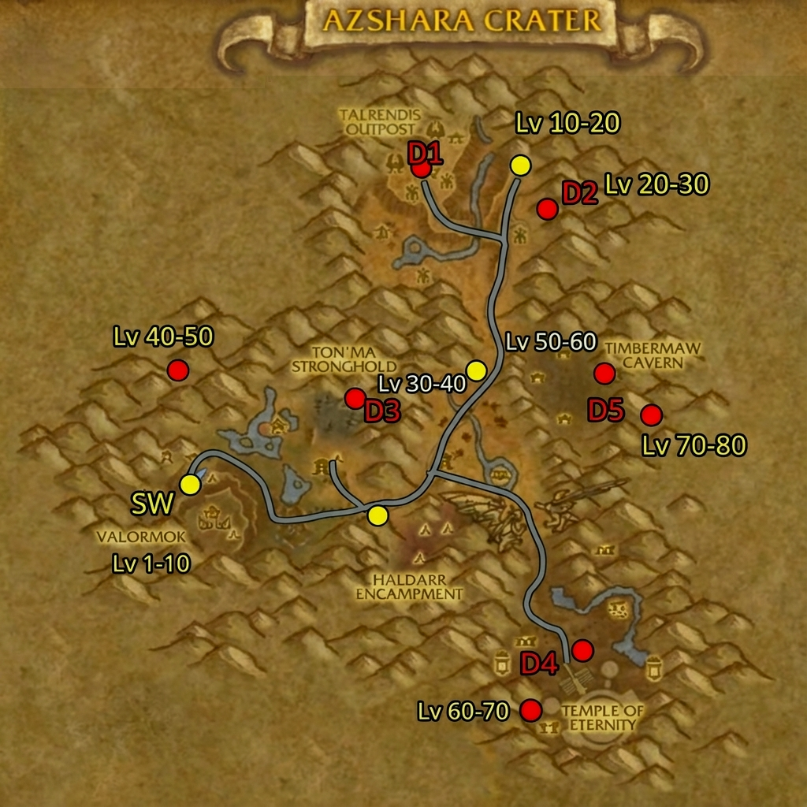

# Azshara Crater - Quest System Design
## Quest NPCs, Templates & Examples

> [!NOTE]
> Quests do NOT unlock zones/dungeons. Uses existing heirloom gameobjects as special features.

---

## Quest NPC Templates (Verified WotLK Entry IDs)



### Quest Giver NPCs

| Role | NPC Name | Entry ID | Model | Location |
|------|----------|----------|-------|----------|
| **Main Horde** | Ag'tor Bloodfist | 11821 | Orc Warrior | Valormok |
| **Main Alliance** | Jarrodenus | 9116 | Night Elf Male | Valormok |
| **Neutral Leader** | Talo Thornhoof | 5639 | Tauren Elder | Ton'ma |
| **Furbolg Rep** | Nafien | 15395 | Furbolg | East Outpost |
| **Dragon Rep** | Haleh | 10929 | Blue Dragon | Temple Approach |
| **Shaman** | Kardris Dreamseeker | 3344 | Orc Shaman | Valormok |
| **Scout** | Huntress Ravenoak | 10301 | Night Elf Hunter | North Checkpoint |
| **Mage** | Archmage Xylem | 8379 | Human Mage | Temple Approach |

### Service NPCs

| Role | NPC Name | Entry ID | Model | Notes |
|------|----------|----------|-------|-------|
| **Innkeeper** | Innkeeper Allisara | 6740 | Night Elf Female | Bind point |
| **Flight Master** | Rawl | 12902 | Orc Male | Wyvern |
| **Flight Master** | Daelyshia | 12903 | Night Elf Female | Hippogryph |
| **Stable Master** | Jaelysia | 8659 | Night Elf Female | Pet stable |
| **Repair** | Zixil | 3537 | Goblin Male | Anvil vendor |
| **General Goods** | Montarr | 8150 | Tauren Male | Supplies |
| **Reagents** | Kulwia | 3012 | Tauren Female | Magic supplies |

### Guard NPCs

| Role | NPC Name | Entry ID | Model | Faction |
|------|----------|----------|-------|---------|
| **Horde Guard** | Orgrimmar Grunt | 3296 | Orc Male | Horde |
| **Alliance Guard** | Sentinel | 3211 | Night Elf Female | Alliance |
| **Neutral Guard** | Bluffwatcher | 3084 | Tauren Male | Neutral |
| **Furbolg Guard** | Timbermaw Warrior | 7157 | Furbolg | Neutral |

---

## Quest Examples by Zone

### Zone 1: Valormok Rim (Level 1-10)

#### Quest 1: "Welcome to the Crater"
- **Level:** 1
- **Type:** Intro
- **Giver:** Ag'tor Bloodfist (11821) / Jarrodenus (9116)
- **Objective:** Speak with Commander at main base
- **Reward:** 50 XP, 6 slot bag
- **Script:** Simple gossip → complete

#### Quest 2: "Crater Wildlife Survey"
- **Level:** 3
- **Type:** Kill
- **Giver:** Kardris Dreamseeker (3344)
- **Objective:** Kill 8 Crater Wolves (use existing wolf NPC scaled)
- **Reward:** 150 XP, green mail boots
- **Script:** Basic kill credit tracking

#### Quest 3: "Bear Bounty"
- **Level:** 5
- **Type:** Collect
- **Giver:** Montarr (8150)
- **Objective:** Collect 6 Bear Pelts (item drop from bears)
- **Reward:** 200 XP, 5 silver
- **Script:** Loot item from kills, deliver to NPC

#### Quest 4: "Strange Energies"
- **Level:** 7
- **Type:** Interact
- **Giver:** Archmage Xylem (8379)
- **Objective:** Investigate 4 Arcane Leylines (gameobjects)
- **Reward:** 250 XP, green wand
- **Script:** Click gameobjects to "investigate"

#### Quest 5: "Report to the North"
- **Level:** 10
- **Type:** Travel
- **Giver:** Ag'tor Bloodfist (11821)
- **Objective:** Speak with Huntress Ravenoak at Northern Checkpoint
- **Reward:** 300 XP, flight path unlock
- **Script:** Deliver message NPC to NPC

---

### Zone 2: Northern Ruins (Level 10-20)

#### Quest 1: "The Haunted Grounds"
- **Level:** 12
- **Type:** Kill
- **Giver:** Huntress Ravenoak (10301)
- **Objective:** Slay 10 Highborne Apparitions (7971)
- **Reward:** 400 XP, green cloth gloves
- **Script:** Kill credit

#### Quest 2: "Spectral Samples"
- **Level:** 14
- **Type:** Collect
- **Giver:** Archmage Xylem (8379)
- **Objective:** Collect 8 Ghost Essence (drop from ghosts)
- **Reward:** 500 XP, blue wand
- **Script:** Item drop collection

#### Quest 3: "Ancient Relics"
- **Level:** 16
- **Type:** Collect
- **Giver:** Talo Thornhoof (5639)
- **Objective:** Retrieve 5 Ancient Night Elf Relics (from ground objects)
- **Reward:** 600 XP, green ring
- **Script:** Gameobject interaction

#### Quest 4: "The Wailing Noble"
- **Level:** 18
- **Type:** Elite Kill
- **Giver:** Huntress Ravenoak (10301)
- **Objective:** Defeat Lingering Highborne (7973) x3
- **Reward:** 700 XP, blue cloth chest
- **Script:** Elite mob kill credit

#### Quest 5: "Varo'then's Journal"
- **Level:** 20
- **Type:** Collect + Elite
- **Giver:** Archmage Xylem (8379)
- **Objective:** Obtain Varo'then's Journal from his ghost (7970)
- **Reward:** 800 XP, blue off-hand book
- **Script:** Boss drop item

---

### Zone 3: Timbermaw Slopes (Level 20-30)

#### Quest 1: "Proving Grounds"
- **Level:** 22
- **Type:** Kill
- **Giver:** Nafien (15395)
- **Objective:** Kill 12 Deadwood Furbolgs (7153, 7155)
- **Reward:** 500 XP, +250 Timbermaw Rep
- **Script:** Faction kill credit

#### Quest 2: "Supply Run"
- **Level:** 24
- **Type:** Collect
- **Giver:** Nafien (15395)
- **Objective:** Gather 10 Deadwood Headdress Feathers
- **Reward:** 600 XP, +350 Timbermaw Rep
- **Script:** Item collection

#### Quest 3: "Wisdom of the Elders"
- **Level:** 26
- **Type:** Escort
- **Giver:** Timbermaw Elder NPC
- **Objective:** Escort Elder to safety
- **Reward:** 700 XP, green leather helm
- **Script:** Escort AI pathing

#### Quest 4: "The Corruption Source"
- **Level:** 28
- **Type:** Investigation
- **Giver:** Kardris Dreamseeker (3344)
- **Objective:** Investigate 3 Fel-touched areas
- **Reward:** 800 XP, blue trinket
- **Script:** Gameobject discovery

#### Quest 5: "Cleansing Ritual"
- **Level:** 30
- **Type:** Use Item
- **Giver:** Kardris Dreamseeker (3344)
- **Objective:** Use Cleansing Totem on 5 corrupted trees
- **Reward:** 900 XP, blue staff
- **Script:** Item use on gameobject

---

### Zone 4-8: Quest Template Format

For remaining zones, use this template:

```
Quest Name: [Name]
Level: [X]
Type: [Kill/Collect/Escort/Elite/Use Item/Investigate]
Giver NPC: [Name] (Entry ID)
Objective: [Clear description]
Target NPCs: [Entry IDs if applicable]
Reward: [XP amount], [Item reward]
Script Type: [kill_credit/item_collect/escort/use_item/boss_kill]
```

---

## Special Quest Types

### Daily Quests (Available at Level 30+)

| Quest Name | Level | Objective | Reward |
|------------|-------|-----------|--------|
| "Naga Patrol" | 35 | Kill 15 Spitelash (any) | 500 XP, 50 silver |
| "Fel Crystal Harvest" | 55 | Collect 8 Fel Crystals | 800 XP, 1 gold |
| "Dragon Scale Collection" | 65 | Collect 10 Azure Scales | 1000 XP, 2 gold |
| "Ghostly Tribute" | 75 | Kill 20 Temple ghosts | 1500 XP, 5 gold |

### Group Quests (2-3 Players)

| Quest Name | Level | Objective | Reward |
|------------|-------|-----------|--------|
| "The Elite Guard" | 25 | Kill 3 Lingering Highborne (Elite) | Blue weapon |
| "Naga Warlord" | 50 | Defeat Duke Hydraxis helper | Blue armor |
| "Demon Commander" | 60 | Kill Doomguard Commander | Epic ring |
| "Dragon Challenge" | 75 | Prove worth to Azuregos | Epic trinket |

### Heirloom Interaction Quests

| Quest Name | Level | Heirloom Object | Reward |
|------------|-------|-----------------|--------|
| "The Ancient Chest" | 10 | Heirloom Chest #1 | Bonus XP token |
| "Mystical Cache" | 30 | Heirloom Chest #2 | Heirloom upgrade |
| "Dragon's Hoard" | 50 | Heirloom Chest #3 | Epic heirloom |
| "The Queen's Treasury" | 70 | Heirloom Chest #4 | Legendary material |

---

## Quest Chain Examples

### Chain: "The Crater's Secret" (Zone 1-3)

| Step | Level | Quest Name | Objective |
|------|-------|------------|-----------|
| 1 | 5 | "Strange Stones" | Collect 3 glowing stones |
| 2 | 10 | "The First Fragment" | Find fragment in ruins |
| 3 | 15 | "Ghostly Knowledge" | Speak with friendly ghost |
| 4 | 20 | "The Second Fragment" | Retrieve from elite mob |
| 5 | 25 | "Furbolg Wisdom" | Consult Timbermaw elder |
| 6 | 30 | "The Complete Picture" | Combine fragments |
| **Final Reward:** Epic ring + 5000 XP bonus |

### Chain: "The Demon Threat" (Zone 5-6)

| Step | Level | Quest Name | Objective |
|------|-------|------------|-----------|
| 1 | 40 | "Satyr Scouts" | Kill 10 Legashi Satyr |
| 2 | 45 | "Capture Orders" | Loot orders from Hellcaller |
| 3 | 50 | "Portal Fragments" | Collect 5 portal shards |
| 4 | 55 | "Infiltration" | Kill without being detected (stealth optional) |
| 5 | 60 | "The Demon Lord" | Defeat Sethir the Ancient |
| **Final Reward:** Epic weapon + title "Demonbane" |

---

## NPCs Summary for Implementation

| Category | Count | Entry ID Range |
|----------|-------|----------------|
| Quest Givers | 8 | Existing WotLK IDs |
| Service NPCs | 7 | Existing WotLK IDs |
| Guards | 4 | Existing WotLK IDs |
| **Total Base NPCs** | 19 | All verified |

---

> [!TIP]
> Quest scripting can use AzerothCore SmartAI or Eluna Lua scripts. All NPC entry IDs are verified from wowhead.com/wotlk.
