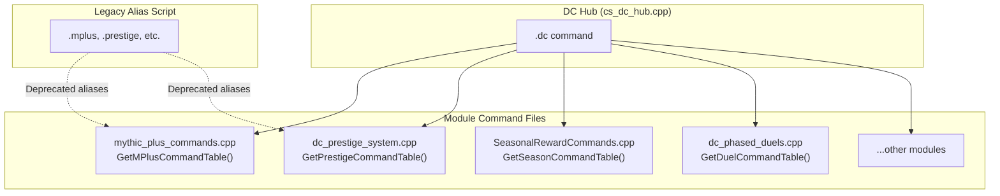

# DC Command Unification Plan

## Overview

This document outlines the effort required to rename all DarkChaos commands to use a unified `.dc` prefix and consolidate command files into the DC scripts directory.

**Last Updated:** 2025-12-29  
**Status:** Planning/Evaluation

---

## Current State Analysis

### Commands Already in DC Scripts Directory (20+ files)

| File | Current Command | Proposed Command | Location |
|------|-----------------|------------------|----------|
| `dc_prestige_system.cpp` | `.prestige` | `.dc prestige` | Prestige/ |
| `dc_prestige_challenges.cpp` | `.prestige challenge` | `.dc prestige challenge` | Prestige/ |
| `dc_prestige_alt_bonus.cpp` | `.prestige altbonus` | `.dc prestige altbonus` | Prestige/ |
| `SeasonalRewardCommands.cpp` | `.season` | `.dc season` | Seasons/ |
| `mythic_plus_commands.cpp` | `.mplus` | `.dc mplus` | MythicPlus/ |
| `keystone_admin_commands.cpp` | `.keystone` | `.dc keystone` | MythicPlus/ |
| `dc_mythic_spectator.cpp` | `.spectate` / `.mspec` | `.dc spectate` | MythicPlus/ |
| `ac_hotspots.cpp` | `.hotspots` / `.hotspot` | `.dc hotspots` | Hotspot/ |
| `ac_aoeloot.cpp` | `.aoeloot` | `.dc aoeloot` | DC/ |
| `dc_aoeloot_extensions.cpp` | `.lootpref` / `.lp` | `.dc loot` | DC/ |
| `dc_phased_duels.cpp` | `.duel` | `.dc duel` | PhasedDuels/ |
| `DungeonQuestMasterFollower.cpp` | `.dcquest` | `.dc quest` | DungeonQuests/ |
| `dc_challenge_modes_customized.cpp` | `.challenge` | `.dc challenge` | ChallengeMode/ |
| `ItemUpgradeGMCommands.cpp` | `.upgrade` | `.dc upgrade` | ItemUpgrades/ |
| `ItemUpgradeProgressionImpl.cpp` | `.upgradeprog` | `.dc upgradeprog` | ItemUpgrades/ |
| `ItemUpgradeAdvancedImpl.cpp` | `.upgradeadv` | `.dc upgradeadv` | ItemUpgrades/ |
| `ItemUpgradeSeasonalImpl.cpp` | `.upgradeseason` | `.dc upgradeseason` | ItemUpgrades/ |
| `ItemUpgradeAddonHandler.cpp` | `.dcupgrade` | `.dc upgrade addon` | ItemUpgrades/ |
| `aio_bridge.cpp` | `.aio` | `.dc aio` | AIO/ |
| `cs_gps_test.cpp` | `.gpstest` | `.dc gpstest` | MapExtension/ |
| `cs_flighthelper_test.cpp` | `.flighthelper` | `.dc flighthelper` | AC/ |
| `hlbg_native_broadcast.cpp` | `.hlbglive` | `.dc hlbglive` | HinterlandBG/ |

### Commands in `/src/server/scripts/Commands/` (Need Moving)

| File | Current Command | Proposed Command | Target Location |
|------|-----------------|------------------|--------------------|
| `cs_dcrxp.cpp` | `.dcrxp` / `.dcxrp` | Merge into `.dc` | DC/Commands/ |
| `cs_dc_addons.cpp` | `.dc` | Already `.dc` (hub) | DC/Commands/ |
| `cs_dc_dungeonquests.cpp` | `.dcquests` | `.dc quests` | DC/Commands/ |
| `cs_hl_bg.cpp` | `.hlbg` | `.dc hlbg` | DC/HinterlandBG/ |

---

## Proposed New Command Structure

```
.dc                              - Main hub (shows help)
├── prestige                     - Prestige system
│   ├── info                     - Show prestige info
│   ├── reset                    - Initiate reset
│   ├── confirm                  - Confirm reset
│   ├── challenge                - Challenge subcommands
│   │   ├── start <name>
│   │   ├── status
│   │   └── list
│   └── altbonus info            - Alt bonus info
├── season                       - Seasonal rewards
│   ├── info / stats / reload / award / reset / setseason / multiplier / chest
├── mplus                        - Mythic+ system
│   ├── info / cancel / keystone / give / vault / affix / scaling / season
├── keystone                     - Keystone admin
│   ├── spawn / info / reward / start
├── spectate                     - M+ spectator
│   ├── list / join / code / player / watch / leave / invite / guild / replays / replay / stream / reload
├── hotspots                     - XP hotspots
│   ├── status / bonus / list / spawn / spawnhere / spawnworld / testmsg / testpayload / testxp / setbonus / addonpackets / dump / clear / reload / tp / forcebuff
├── aoeloot                      - AoE loot base
│   ├── info / messages / top / stats / reload / force
├── loot                         - Loot preferences (was .lootpref / .lp)
│   ├── toggle / enable / disable / messages / msg / quality / skin / skinset / smart / smartset / ignore / unignore / stats / reload
├── duel                         - Phased duels
│   ├── stats / top / reset / reload
├── quest                        - Dungeon quest master (was .dcquest)
│   ├── summon / dismiss
├── quests                       - Dungeon quest management (was .dcquests)
│   ├── help / list / info / give-token / reward / progress / reset / debug / achievement / title
├── challenge                    - Challenge modes
│   └── (shows active challenges)
├── upgrade                      - Item upgrade system
│   ├── status / list / info
│   ├── token add/remove/set/info
│   └── mech cost/stats/ilvl/reset
├── upgradeprog                  - Upgrade progression
│   ├── mastery / weekcap / unlocktier / tiercap / testset
├── upgradeadv                   - Advanced upgrades
│   ├── respec / achievements / guild
├── upgradeseason                - Seasonal upgrades
│   ├── info / leaderboard / history / reset
├── hlbg                         - Hinterland BG
│   ├── status / get / set / reset / history / statsmanual / affix / warmup / results / live / historyui / statsui
│   └── queue join/leave/status
├── aio                          - AIO bridge
│   └── ping
├── gpstest                      - GPS diagnostic
├── flighthelper                 - Flight path helper
│   └── path <x> <y> <z>
├── send <player>                - Send XP addon msg (legacy from .dcrxp)
├── sendforce <player>           - Force send XP msg
├── grant <player> <amt>         - Grant XP
├── grantself <amt>              - Grant XP to self
├── givexp <player|self> <amt>   - Give XP
├── difficulty <mode>            - Set dungeon difficulty
└── reload mythic                - Reload mythic config
```

---

## Recommended Implementation Strategy

> [!IMPORTANT]
> After analyzing the existing codebase, the recommended approach is **Option D: Subtable Export Pattern** which provides the cleanest architecture with minimal code changes.

### Option D: Subtable Export Pattern (Recommended ⭐)

This approach leverages AzerothCore's native `ChatCommandTable` nesting while keeping each module self-contained.

#### How It Works

1. **Each module exposes its command subtable** via a public function in a header file
2. **The hub file imports all subtables** and registers them under `.dc`
3. **Legacy aliases are registered separately** for backwards compatibility
4. **No file moving required** - just add exports and hub registration

#### Architecture Diagram



#### Example Implementation

**Step 1: Create header for exports** (`DC/Commands/dc_command_exports.h`)
```cpp
#pragma once
#include "ChatCommand.h"

namespace DC::Commands {
    // Each module exports its subtable
    Acore::ChatCommands::ChatCommandTable& GetMPlusCommandTable();
    Acore::ChatCommands::ChatCommandTable& GetPrestigeCommandTable();
    Acore::ChatCommands::ChatCommandTable& GetSeasonCommandTable();
    Acore::ChatCommands::ChatCommandTable& GetHotspotsCommandTable();
    Acore::ChatCommands::ChatCommandTable& GetDuelCommandTable();
    Acore::ChatCommands::ChatCommandTable& GetUpgradeCommandTable();
    Acore::ChatCommands::ChatCommandTable& GetHLBGCommandTable();
    // ... etc
}
```

**Step 2: Modify module files** (example: `mythic_plus_commands.cpp`)
```cpp
// ADD: Export function at the end of file
namespace DC::Commands {
    Acore::ChatCommands::ChatCommandTable& GetMPlusCommandTable()
    {
        static ChatCommandTable vaultTable =
        {
            { "generate", HandleMPlusVaultGenerateCommand, SEC_GAMEMASTER, Console::No },
            { "addrun",   HandleMPlusVaultAddRunCommand,   SEC_GAMEMASTER, Console::No },
            { "reset",    HandleMPlusVaultResetCommand,    SEC_GAMEMASTER, Console::No },
        };
        
        static ChatCommandTable mplusTable =
        {
            { "keystone", HandleMPlusKeystoneCommand, SEC_GAMEMASTER, Console::No },
            { "give",     HandleMPlusGiveCommand,     SEC_GAMEMASTER, Console::No },
            { "vault",    vaultTable },
            { "affix",    HandleMPlusAffixCommand,    SEC_GAMEMASTER, Console::No },
            { "scaling",  HandleMPlusScalingCommand,  SEC_GAMEMASTER, Console::No },
            { "season",   HandleMPlusSeasonCommand,   SEC_GAMEMASTER, Console::No },
            { "info",     HandleMPlusInfoCommand,     SEC_PLAYER,     Console::No },
            { "cancel",   HandleMPlusCancelCommand,   SEC_PLAYER,     Console::No }
        };
        return mplusTable;
    }
}

// MODIFY: GetCommands() to use export
ChatCommandTable GetCommands() const override
{
    static ChatCommandTable commandTable =
    {
        { "mplus", DC::Commands::GetMPlusCommandTable() }  // Legacy alias
    };
    return commandTable;
}
```

**Step 3: Create hub file** (`DC/Commands/cs_dc_hub.cpp`)
```cpp
#include "CommandScript.h"
#include "Chat.h"
#include "dc_command_exports.h"

using namespace Acore::ChatCommands;

class dc_hub_commandscript : public CommandScript
{
public:
    dc_hub_commandscript() : CommandScript("dc_hub_commandscript") { }

    ChatCommandTable GetCommands() const override
    {
        static ChatCommandTable dcTable =
        {
            { "mplus",       DC::Commands::GetMPlusCommandTable() },
            { "prestige",    DC::Commands::GetPrestigeCommandTable() },
            { "season",      DC::Commands::GetSeasonCommandTable() },
            { "hotspots",    DC::Commands::GetHotspotsCommandTable() },
            { "duel",        DC::Commands::GetDuelCommandTable() },
            { "upgrade",     DC::Commands::GetUpgradeCommandTable() },
            { "hlbg",        DC::Commands::GetHLBGCommandTable() },
            // ... all other modules
        };

        static ChatCommandTable commandTable =
        {
            { "dc", dcTable }
        };
        return commandTable;
    }
};

void AddSC_dc_hub_commandscript()
{
    new dc_hub_commandscript();
}
```

---

## Implementation Phases

### Phase 1: Foundation (1-2 hours)

| Task | Description | Files |
|------|-------------|-------|
| Create exports header | Define all GetXxxCommandTable() declarations | `DC/Commands/dc_command_exports.h` |
| Create hub script | Central `.dc` command registration | `DC/Commands/cs_dc_hub.cpp` |
| Update CMake | Add new directory and files | `DC/CMakeLists.txt`, `DC/Commands/CMakeLists.txt` |
| Register hub | Add to script loader | `dc_script_loader.cpp` |

### Phase 2: Module Migration (3-4 hours)

For each module, apply these changes:

1. **Add export function** that returns the module's `ChatCommandTable&`
2. **Keep legacy registration** in `GetCommands()` for backwards compatibility
3. **Update handlers** to be accessible from namespace (may need `static` removal)

| Module | Priority | Estimated Time |
|--------|----------|----------------|
| Mythic+ (`mythic_plus_commands.cpp`) | High | 20 min |
| Prestige (`dc_prestige_system.cpp`) | High | 20 min |
| Seasons (`SeasonalRewardCommands.cpp`) | Medium | 15 min |
| Hotspots (`ac_hotspots.cpp`) | Medium | 15 min |
| Duels (`dc_phased_duels.cpp`) | Low | 10 min |
| Item Upgrades (4 files) | Medium | 40 min |
| HLBG (`cs_hl_bg.cpp`) | Medium | 20 min |
| AoE Loot (2 files) | Low | 20 min |
| Others | Low | 1 hour |

### Phase 3: Consolidate cs_dc_addons.cpp (30 min)

The existing `cs_dc_addons.cpp` already handles some `.dc` subcommands:
- Move its direct handlers into the hub or keep as-is
- Ensure no conflicts with new hub registration

### Phase 4: Legacy Alias Deprecation (Optional)

> [!TIP]
> Keep legacy aliases (`.mplus`, `.prestige`, etc.) working indefinitely via the existing module registrations. Only remove when confirmed safe.

### Phase 5: Testing & Documentation (1 hour)

1. **Test all commands** via in-game execution
2. **Update `Custom/Commands.md`** with new `.dc` prefix documentation
3. **Update addon Lua code** if any addons call commands via SendChatMessage

---

## Effort Summary

| Phase | Description | Estimated Time |
|-------|-------------|----------------|
| 1 | Foundation (header, hub, CMake) | 1-2 hours |
| 2 | Module migration (export functions) | 3-4 hours |
| 3 | Consolidate cs_dc_addons.cpp | 30 min |
| 4 | Legacy aliases (optional) | 0 min (keep as-is) |
| 5 | Testing & documentation | 1 hour |
| **Total** | | **5-7 hours** |

---

## Comparison of Approaches

| Approach | Pros | Cons | Effort |
|----------|------|------|--------|
| **A: Single Hub File** | Single point of registration | Massive file, merge conflicts | High |
| **B: Hub + Delegate** | Clean separation | Complex cross-file exports | Medium |
| **C: Nested Auto-Registration** | Minimal changes to existing | Complex init order, debugging hard | Medium |
| **D: Subtable Export (Recommended)** | Clean, modular, AzerothCore-native pattern | Requires header file | **Low** |

---

## Risk Assessment

| Risk | Severity | Mitigation |
|------|----------|------------|
| Breaking player macros | High | Keep legacy aliases indefinitely |
| Breaking addon code | Medium | Test addon communication thoroughly |
| Build failures from moved files | Low | Incremental changes, careful CMake |
| Command conflicts with AzerothCore base | Low | `.dc` prefix ensures uniqueness |
| Initialization order issues | Low | Static tables with lazy init |

---

## Files Reference

### New Files to Create
- `src/server/scripts/DC/Commands/CMakeLists.txt`
- `src/server/scripts/DC/Commands/cs_dc_hub.cpp`
- `src/server/scripts/DC/Commands/dc_command_exports.h`

### Files to Modify
- All 22+ command files (add export function)
- `src/server/scripts/DC/CMakeLists.txt` (add subdirectory)
- `src/server/scripts/DC/dc_script_loader.cpp` (register hub)

### Files to Keep As-Is
- `src/server/scripts/Commands/cs_dc_addons.cpp` (existing `.dc` handlers)
- All module files in their current locations

---

## Quick Start Implementation Order

1. Create `DC/Commands/` directory
2. Create `dc_command_exports.h` with all forward declarations
3. Create `cs_dc_hub.cpp` with empty tables initially
4. Update CMake files
5. Migrate one module (e.g., mythic_plus) as proof of concept
6. Test `.dc mplus info` works
7. Gradually migrate remaining modules
8. Final testing round

---

## Decision Checklist

Before proceeding:

- [ ] Confirm approach: Subtable Export Pattern (Option D)
- [ ] Keep legacy commands forever or deprecate after N patches?
- [ ] Update addons simultaneously or after server changes?
- [ ] Priority modules to migrate first?
