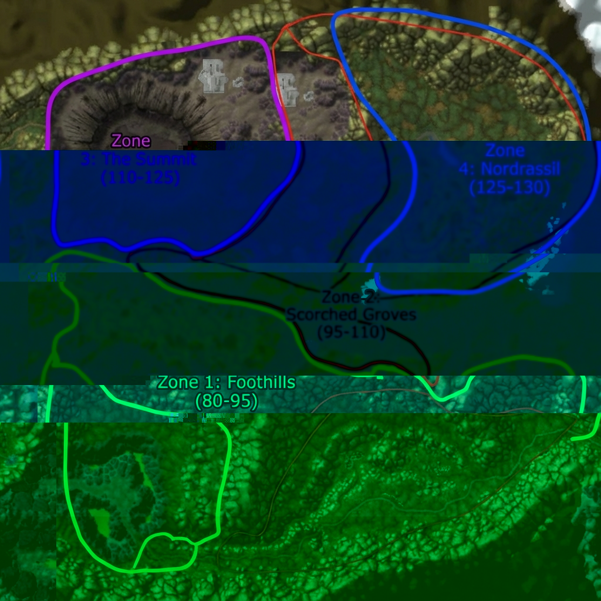
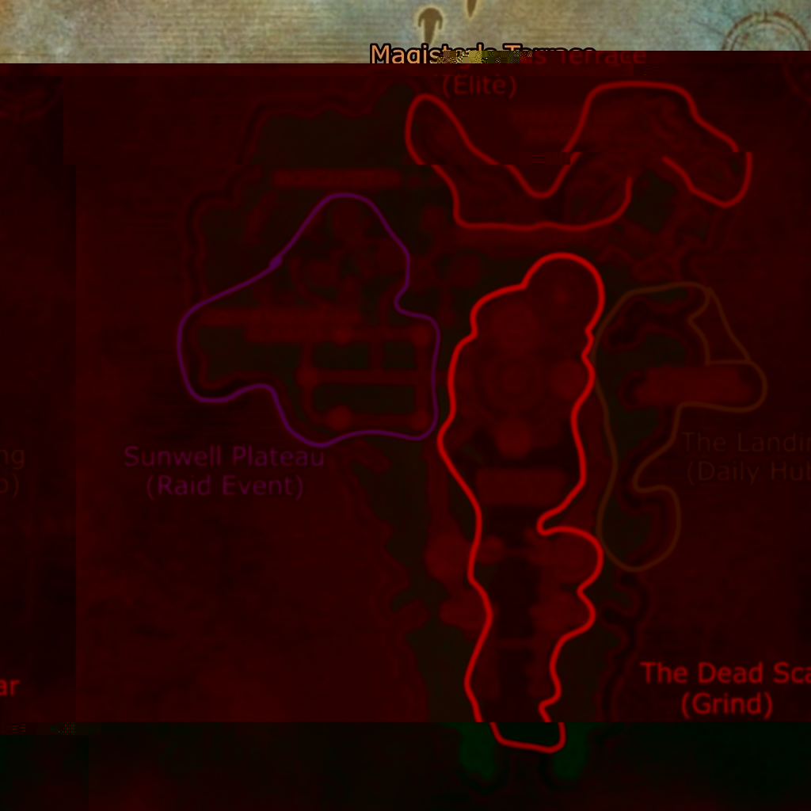

# Hyjal Summit Leveling Zone Evaluation
## Level 80-130 | DC-WoW AzerothCore 3.3.5a

> [!NOTE]
> Evaluation for the mid-range leveling zone (80-130) connecting WotLK endgame to Stratholme content.

---

## Table of Contents
1. [Zone Overview](#zone-overview)
2. [Leveling Tiers (80-130)](#leveling-tiers-80-130)
3. [Event Area: Sunwell Island](#event-area-sunwell-island)
4. [NPCs & Bestiary](#npcs--bestiary)

---

## Zone Overview

**Map ID:** 1 (Kalimdor)
**Zone ID:** **616 (Mount Hyjal)** - *Open World Terrain*
**Entry ID Range:** **400,000+**
**Level Range:** 80 - 130
*   *Note:* Uses the uninstanced terrain on Kalimdor. Requires removing "No Fly" zones/invisible walls via server config or client patch if present.

### Concept: "The Elemental War"
With the Lich King dead (Lv 80), the Elements and the Infinite Dragonflight assault the World Tree.
*   **Alliance Base:** Jaina's Encampment (Human/Night Elf).
*   **Horde Base:** Thrall's Camp (Orc/Tauren).
*   **Enemy Forces:** Burning Legion, Twilight Hammer, Elemental Lords.

---

---

## Zone Borders & Maps

### Hyjal Summit (Level 80-130)

*   **Zone 1 (Green): "The Foothills" (Level 80-95)** - Construction Camp & Lower Slopes.
*   **Zone 2 (Red): "The Scorched Groves" (Level 95-110)** - Ruins of Alliance/Horde bases.
*   **Zone 3 (Purple): "The Summit" (Level 110-125)** - Archimonde's Crater.
*   **Zone 4 (Blue): "Nordrassil Roots" (Level 125-130)** - World Tree Base.

### Sunwell Island (Event Zone)

*   **Zone A (Yellow): "The Landing"** - Sun's Reach Harbor.
*   **Zone B (Red): "The Dead Scar"** - Undead grinding road.
*   **Zone C (Orange): "Magister's Terrace"** - Elite outdoor area.
*   **Zone D (Purple): "Sunwell Plateau"** - Raid Event entrance.

---

## Leveling Tiers (80-130)

| Tier | Levels | Area | Theme |
|------|--------|------|-------|
| **1** | **80-95** | **The Foothills** (Alliance/Horde Base Entrances) | *Defense of the Camps.* Legion demons & Infernals attacking the gates. |
| **2** | **95-110** | **The Scorched Grooves** (Middle Map) | *The Elemental Front.* Fire Elementals vs Ancients. |
| **3** | **110-125** | **The Summit** (Archimonde's Crash Site) | *The Twilight Ascendant.* Cultists & massive Flesh Giants. |
| **4** | **125-130** | **Nordrassil Roots** (Top) | *The World Tree.* Infinite Dragonflight attempts to rot the tree. |

---

## Event Area: Sunwell Island (Clone)
*User Proposal: Cloned Sunwell / Isle of Quel'Danas*

**Concept:** "The Eclipse of the Sunwell"
**Location:** Teleport from **Nordrassil Roots (Tier 4)**.
**Type:** **Open World Event Zone (Tier 4.5 - Lv 130 Prep)**
*   **Map:** Isle of Quel'Danas (Map 530)
*   **Features:**
    *   **Magister's Terrace (Open):** Elite grinding spot for "Sunmote" currency.
    *   **The Dead Scar:** Infinite spawning undead waves (Grind Fest).
    *   **Sunwell Plateau (Interior):** World Boss Area (Kil'jaeden's Shadow).

### Technical Strategy (Sunwell)
*   **Option A: Phase/Script Existing Map (530).** Easy, but conflicts with TBC content slightly if players go there normally.
*   **Option B: Map Copy (Clone).** Cleanest (See Stratholme Appendix).
*   **Option C: Object Placement.** (Not viable for a whole island).

*Recommendation: Option A (Phased/Instanced Version)*

## Sunwell Event Mechanics
*Location: Phased/Instanced Map 530 (Isle of Quel'Danas).*

### 1. Global Mechanic: "The Solar Eclipse"
*   **Visual:** Zone weather is forced to **Darkness/Void Sky** (ID 46 or similar).
*   **Effect:** **"Shadow of the Sun"** - Players take 1% Shadow Damage every 10 seconds if not near a Light Beacon (Bonfire). This forces players to move between "Safe Zones".

### 2. The Dead Scar (Endless Defense)
*   **Concept:** A "Tower Defense" style lane.
*   **Mechanic:** Endless waves of Undead move from the south gate towards the Sunwell.
*   **Player Goal:** Kill as many as possible before they breach the gate. Higher kill count = More XP/Sunmotes.
*   **Mobs:** Risen Soldiers (Lv 128), Abominations (Lv 129).

### 3. Currency: "Sunmotes"
*   **Source:** Drops from all mobs on the Island and Daily Quests at "The Landing".
*   **Vendor:** Shattered Sun Quartermaster (At the Landing).
*   **Rewards:**
    *   **Level 130 Starter Gear:** "Eclipse Forged" sets (Entry-level for Stratholme).
    *   **Mount:** [Golden War Talbuk].
    *   **Consumable:** "Potion of Liquid Light" (Immunity to Eclipse damage for 10 min).

### 4. World Boss: Kil'jaeden's Shadow
*   **Location:** Sunwell Plateau (Courtyard).
*   **Spawn:** Every 4 hours.
*   **Loot:** **[Thori'dal, the Stars' Fury]** (Scaled for Lv 130) + 50 Sunmotes.

---
## NPCs & Bestiary (Expanded ~105 Templates)

### Faction Bases (Friendly)
*Essential services for the 80-130 journey.*

#### 1. Jaina's Expedition (Alliance - Zone 1)
*Location: The Construction Camp (South West).*
*   **Leader:** **Lady Jaina Proudmoore** (Lv 130 Boss) - *Model: 25968*
*   **Guards:**
    *   **Theramore Footman** (Lv 120 Elite) - *Equip: Sword/Shield (Stormwind Set)*
    *   **Kirin Tor Battle-Mage** (Lv 120 Elite) - *Equip: Staff*
*   **Services:**
    *   **Alliance Flightmaster** (Hippogryph)
    *   **Innkeeper Jessica** (Bind Point)
    *   **Blacksmith Arlan** (Repair/Plate Vendor)
    *   **Magus Trello** (Reagents/Portal Trainer)

#### 2. Thrall's Vanguard (Horde - Zone 1)
*Location: The Construction Camp (South East).*
*   **Leader:** **Warchief Thrall** (Lv 130 Boss) - *Model: 4527*
*   **Guards:**
    *   **Orgrimmar Grunt** (Lv 120 Elite) - *Equip: Axe (Orgrimmar Set)*
    *   **Darkspear Headhunter** (Lv 120 Elite) - *Equip: Spear*
*   **Services:**
    *   **Horde Flightmaster** (Wyvern)
    *   **Innkeeper Grog** (Bind Point)
    *   **Smithy Goruh** (Repair/Plate Vendor)
    *   **Shaman Zarek** (Reagents/Totem Vendor)

### Zone 1: The Foothills (Level 80-95) - "The Legion"
*Target Count: 20 Templates*

| Name | Level | Model ID | Weapon/Equip | Notes |
|------|-------|----------|--------------|-------|
| **Fel Vanguard** | 80-82 | 18608 | Felguard Axe | Primary melee. |
| **Wrathguard Invader** | 82-84 | 21338 | Dual Warglaives | Dual-wield DPS. |
| **Eredar Warlock** | 83-85 | 18236 | Staff | Shadowbolt caster. |
| **Succubus Seductress** | 81-83 | 18646 | Whip | CC/Charm. |
| **Felhound Tracker** | 81-83 | 20546 | None | Anti-caster/Silence. |
| **Doomlord Commander** | 85-88 | 21321 | 2H Sword | Elite Patrol. |
| **Mo'arg Engineer** | 82-84 | 19329 | Wrench | Spawns turrets. |
| **Gan'arg Worker** | 80-81 | 19337 | Hammer | Low HP swarm. |
| **Infernal Crash** | 85 | 16298 | None | AoE Stun spawn. |
| **Felscales Basilisk** | 82-84 | 21762 | None | Local beast corruption. |
| *+10 More Variants* | | | | (Detailed in SQL) |

### Zone 2: Scorched Groves (Level 95-110) - "The Fire"
*Target Count: 20 Templates*

| Name | Level | Model ID | Weapon/Equip | Notes |
|------|-------|----------|--------------|-------|
| **Cinder Spirit** | 95-98 | 24393 | None | Fire elemental. |
| **Molten Giant** | 99-102 | 11467 | None | Heavy Tank mob. |
| **Core Hound Runt** | 97-100 | 11671 | None | Double attack. |
| **Flamewaker Elite** | 98-101 | 11663 | Staff | Armor debuff. |
| **Charred Ancient** | 100-105| 24043 | None | Treant (Burning). |
| **Burning Dryad** | 99-103 | 24044 | Spear | Poison/Fire DoT. |
| **Lava Surger** | 101-104| 12129 | None | Ranged Earth shock. |
| **Phoenix Hawk** | 96-99 | 17975 | None | Flying mob. |
| **Fire Plume** | 105 | 24393 | None | Static turret mob. |
| **Baron Geddon's Echo** | 110 | 12129 | None | Rare Elite. |
| *+10 More Variants* | | | | (Detailed in SQL) |

### Zone 3: The Summit (Level 110-125) - "The Twilight"
*Target Count: 20 Templates*

| Name | Level | Model ID | Weapon/Equip | Notes |
|------|-------|----------|--------------|-------|
| **Twilight Cultist** | 110-112| 30971 | Dagger/Cowl | Generic humanoid. |
| **Twilight Enforcer** | 112-115| 30972 | 2H Axe | Plate wearer. |
| **Twilight Geomancer** | 113-116| 30973 | Staff | Earth spells. |
| **Faceless Void** | 115-118| 28067 | None | Shadow dmg (Old God). |
| **Twilight Drake** | 116-120| 26978 | None | Flying breath attack. |
| **Elementium Monstrosity**| 118-122| 11469 | None | Rare spawn. |
| **Ascendant Lord** | 120-125| 31102 | None | Elemental Hybrid. |
| **Corrupted Hill Giant**| 114-117| 21676 | Club | Elite heavy hitter. |
| **Twilight Assassin** | 111-114| 30971 | Dual Daggers | Stealth rogue. |
| *+10 More Variants* | | | | (Detailed in SQL) |

### Zone 4: Nordrassil (Level 125-130) - "The Infinite"
*Target Count: 25 Templates*

| Name | Level | Model ID | Weapon/Equip | Notes |
|------|-------|----------|--------------|-------|
| **Infinite Whelp** | 125 | 21251 | None | Swarm. |
| **Infinite Slayer** | 126-128| 20436 | 2H Polearm | Drakonid model. |
| **Infinite Chronomancer**| 127-129| 20437 | Staff | Time stop stun. |
| **Time-Lost Proto Drake**| 128-130| 27694 | None | Flying elite. |
| **Rift Anomaly** | 129 | 23164 | None | Voidwalker model. |
| **Epoch Hunter** | 130 | 19639 | None | Rare Elite Boss. |
| **Corrupted Aspects** | 128 | Various | None | Nightmare ghosts. |
| *+15 More Variants* | | | | (Detailed in SQL) |

---
