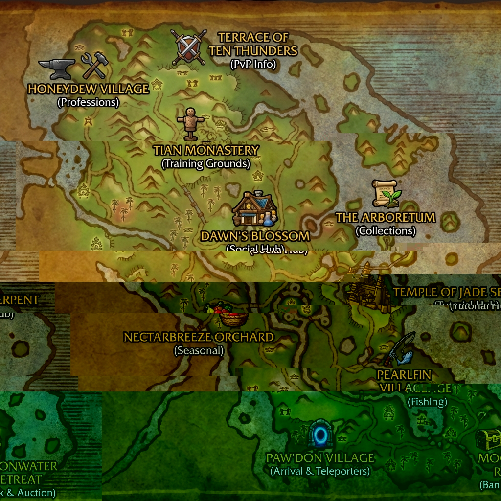

# Jadeforest Playerbase - Detailed Implementation Guide

**Document Type:** Design Specification  
**Zone:** Jade Forest (Map ID 870)  
**Purpose:** Peaceful hub for all levels

---

## 🗺️ Zone Map with Location Markers



### Location Overview (Map Reference)

```
                         N
                         ↑
    ┌─────────────────────────────────────────────────────────────┐
    │                                                              │
    │   🍯 HONEYDEW          ⚡ TERRACE OF         🌊 SRI-LA       │
    │   VILLAGE              TEN THUNDERS          VILLAGE        │
    │   (Professions)        (PvP Info)            (World Boss)   │
    │           ↘                ↓                ↙               │
    │               🏛️ TIAN MONASTERY                             │
    │               (Training Grounds)               🏝️ WINDWARD  │
    │                      ↓                          ISLE        │
    │   🦎 GROOKIN    🌸 DAWN'S BLOSSOM    🌳 ARBORETUM           │
    │   HILL          (Social Hub)         (Collections)          │
    │   (Mounts)            ↓                    ↓                │
    │                 💚 SERPENT'S      ⛩️ TEMPLE OF              │
    │                    HEART           JADE SERPENT              │
    │                    (Lore)          (Tutorial Hub)           │
    │                      ↓                                       │
    │         🍎 NECTARBREEZE                                      │
    │            ORCHARD                                           │
    │            (Seasonal)                                        │
    │                ↓                                             │
    │         🏠 PAW'DON          🐟 PEARLFIN                      │
    │            VILLAGE           VILLAGE                         │
    │ ═══════(ARRIVAL HUB)═══════ (Fishing)                       │
    │                ↓                   ↓                         │
    │                        🌙 MOONWATER                          │
    │                           RETREAT                            │
    │                        (Bank & AH)                          │
    └─────────────────────────────────────────────────────────────┘
                         ↓
                    (Coast/Docks)
```

---

## 👤 NPC Model Reference (WotLK DisplayIDs)

### Existing Custom NPCs (800020-800027)

| Entry ID | Name | DisplayID | Scale | Notes |
|----------|------|-----------|-------|-------|
| 800020 | Innkeeper Pandgrimble | **30414** | 2.5 | Pandaren Monk model |
| 800021 | Panda Bruiser (Guard) | **30414** | 2.0 | Pandaren Monk model |
| 800022-27 | Flightmasters | **7102/7103/7104** | 1.0 | Gryphon riding models |
| 800023 | Scarlet Gryphon | **25579** | 1.0 | Taxi vehicle |

### Recommended WotLK Models for New NPCs

#### Hub & Service NPCs (Pandaren Theme)
Use **DisplayID 30414** (Pandaren Monk) with scale variations for thematic consistency:

| NPC Role | Suggested DisplayID | Scale | Visual Style |
|----------|---------------------|-------|--------------|
| Teleporter Guards | 30414 | 1.8 | Pandaren standing guard |
| Tutorial NPCs | 30414 | 1.5 | Smaller, approachable |
| Event Coordinator | 30414 | 1.6 | Medium size |
| Lore NPCs | 30414 | 1.5 | Elderly appearance |

#### Alternative Humanoid Models (Variety)

| DisplayID | Model Description | Best For |
|-----------|-------------------|----------|
| **26714** | Dalaran Citizen Male | Human service NPCs |
| **26715** | Dalaran Citizen Female | Human vendors |
| **24353** | Kirin Tor Wizard | Magical tutorial NPCs |
| **27978** | Argent Crusade Male | Alliance-style guards |
| **27979** | Argent Crusade Female | Alliance-style vendors |
| **28213** | Wyrmrest Accord | Dragonkin themed NPCs |
| **26466** | Sons of Hodir Male | Large imposing NPCs |
| **29169** | Ebon Blade Knight | Dark/mysterious NPCs |

#### Trainer Models (Copy Existing Blizzard)

| NPC Type | Copy From Entry | DisplayID |
|----------|-----------------|-----------|
| Warrior Trainer | 914 | Use creature_template_model |
| Mage Trainer | 328 | Use creature_template_model |
| Priest Trainer | 376 | Use creature_template_model |
| Rogue Trainer | 918 | Use creature_template_model |
| Hunter Trainer | 987 | Use creature_template_model |
| Paladin Trainer | 928 | Use creature_template_model |
| Warlock Trainer | 988 | Use creature_template_model |
| Shaman Trainer | 986 | Use creature_template_model |
| Druid Trainer | 542 | Use creature_template_model |
| Death Knight Trainer | Use Ebon Blade | 29169 |

#### Profession Trainers (Copy Existing)

| Profession | Copy From Entry | Notes |
|------------|-----------------|-------|
| Blacksmithing | 514 | Smith Argus |
| Tailoring | 1103 | Eldrin |
| Herbalism | 812 | Alma Jainrose |
| Alchemy | 1215 | Alchemist Mallory |
| Skinning | 1292 | Maris Granger |

#### Vendor NPCs

| Vendor Type | Suggested DisplayID | Notes |
|-------------|---------------------|-------|
| General Goods | 30414 (Scale 1.4) | Pandaren vendor |
| Food/Drink | 30414 (Scale 1.3) | Pandaren cook |
| Mount Vendor | 26714 | Human stable master style |
| Seasonal Vendor | 30414 (Scale 1.6) | Changes seasonally |

#### Flightmaster Models (Internal Travel)

For internal zone flightmasters, continue using existing pattern:
- **DisplayIDs 7102, 7103, 7104** (Gryphon variants)
- Or use **Cloud Serpent** visual if available via spell effects

---

## 📖 Story Questlines

### Story 1: "Whispers of the Jade Serpent"
**Type:** Lore/Exploration Chain  
**Location:** Serpent's Heart → Temple of Jade Serpent  
**Length:** 6 quests

**Synopsis:** Players learn about the blessing that protects the forest and why this sanctuary remains safe while chaos spreads elsewhere.

| Quest # | Quest Name | NPC | Objective | Reward |
|---------|------------|-----|-----------|--------|
| 1 | "The Protected Forest" | Lorekeeper Mei | Listen to the story | 50g |
| 2 | "Echoes of Yu'lon" | Lorekeeper Mei | Visit Serpent's Heart | 50g + Lore item |
| 3 | "The Jade Blessing" | Spirit of Yu'lon | Find 4 Memory Stones | 100g |
| 4 | "Gathering the Ancients" | Spirit of Yu'lon | Visit Dawn's Blossom, Tian Monastery | 75g |
| 5 | "Heart of the Forest" | Elder Chi'wan | Return to Temple of Jade Serpent | 100g |
| 6 | "Guardian's Promise" | Elder Chi'wan | Complete the blessing ritual | 200g + Achievement |

**Achievement:** "Child of Yu'lon" - Completed the Jade Serpent storyline

---

### Story 2: "Welcome to Dark Chaos"
**Type:** Tutorial/System Introduction Chain  
**Location:** Paw'Don Village → All major locations  
**Length:** 10 quests

**Synopsis:** New players are guided through all DC systems by visiting each location.

| Quest # | Quest Name | System Taught | Location |
|---------|------------|---------------|----------|
| 1 | "New Beginnings" | Basic orientation | Paw'Don |
| 2 | "The Path Forward" | Zone navigation | Dawn's Blossom |
| 3 | "Unlimited Power" | Level 255 system | Temple |
| 4 | "Keys of Challenge" | Mythic+ basics | Temple |
| 5 | "Seasons of Fortune" | Seasonal content | Temple |
| 6 | "The Art of War" | Training & combat | Tian Monastery |
| 7 | "Forged in Fire" | Item upgrades | Temple |
| 8 | "Trials of Champions" | Hardcore modes | Temple |
| 9 | "Collecting Memories" | Collection system | Arboretum |
| 10 | "Champion of Chaos" | Final graduation | Paw'Don |

**Completion Rewards:**
- 500 Gold
- Title: "Newcomer"
- Starter Upgrade Token (T1)
- Jadeforest Tabard

---

### Story 3: "The Wanderer's Path"
**Type:** Exploration/Discovery Chain  
**Location:** All hidden locations  
**Length:** 5 quests (each discovering secrets)

| Quest # | Quest Name | Secret to Find | Hint Given |
|---------|------------|----------------|------------|
| 1 | "Hidden Waters" | Waterfall cave near Pearlfin | "Where water meets stone..." |
| 2 | "The Lost Scroll" | Hidden ledge at Tian Monastery | "Look to the mountain's edge..." |
| 3 | "Whispers in the Wind" | Secret garden at Windward Isle | "The islands hold ancient secrets..." |
| 4 | "The Merchant's Cache" | Hidden vendor at Grookin Hill | "Follow the path less traveled..." |
| 5 | "Master of Secrets" | Central secret at Serpent's Heart | "Where all paths converge..." |

**Completion Rewards:**
- Title: "Jade Explorer"
- Mount: "Viridian Cloud Serpent" (recolored flying mount)
- Achievement: "Secrets of the Jade Forest"

---

### Story 4: "Friendship Across Factions"
**Type:** Social/Community Chain  
**Location:** Dawn's Blossom  
**Length:** 4 quests (requires grouping)

| Quest # | Quest Name | Requirement |
|---------|------------|-------------|
| 1 | "Strength in Numbers" | Group with 2+ other players |
| 2 | "Trading Stories" | Use /say in Dawn's Blossom plaza |
| 3 | "The Training Match" | Duel another player (friendly) |
| 4 | "Bonds of Jade" | Return to event coordinator |

**Completion Rewards:**
- Social title: "Friend of the Forest"
- Cosmetic toy: "Jade Lantern" (summons decorative lantern)

---

### Story 5: "Legends of the Arena"
**Type:** PvP Introduction Chain  
**Location:** Terrace of Ten Thunders  
**Length:** 3 quests

| Quest # | Quest Name | Objective |
|---------|------------|-----------|
| 1 | "Warriors of the Storm" | Speak to Arena Master |
| 2 | "The Art of Combat" | View the arena leaderboard |
| 3 | "Ready for Battle" | Queue for any BG/Arena |

**Completion Rewards:**
- 100 Honor Points
- Information about DC PvP systems

---

## 🖥️ UI Requirements

### Required Addon Extensions (DC-QOS or Dedicated)

#### 1. Zone Welcome Panel
**Purpose:** First-time visitor introduction

```
┌─────────────────────────────────────────────────────────────┐
│  ⛩️ WELCOME TO JADEFOREST PLAYERBASE                        │
├─────────────────────────────────────────────────────────────┤
│                                                             │
│  Welcome, $PLAYER! This is the heart of Dark Chaos -       │
│  a peaceful sanctuary for all heroes.                       │
│                                                             │
│  Here you can:                                              │
│  • Learn about DC systems (Temple of Jade Serpent)          │
│  • Practice combat (Tian Monastery)                         │
│  • Manage your collection (The Arboretum)                   │
│  • Socialize and trade (Dawn's Blossom)                     │
│  • Travel to any zone (Paw'Don teleporters)                │
│                                                             │
│  [Don't show again]                          [Got it! ✓]   │
└─────────────────────────────────────────────────────────────┘
```

**Implementation:** AIO addon message on zone entry (first time only)

---

#### 2. Tutorial Progress Tracker
**Purpose:** Track tutorial questline completion

```
┌─────────────────────────────────────────────────────────────┐
│  📚 WELCOME TUTORIAL                           [Hide]       │
├─────────────────────────────────────────────────────────────┤
│  Progress: ████████░░ 8/10                                  │
│                                                             │
│  ✓ New Beginnings           ✓ Keys of Challenge            │
│  ✓ The Path Forward         ✓ Seasons of Fortune           │
│  ✓ Unlimited Power          ✓ The Art of War               │
│  ✓ Forged in Fire           □ Trials of Champions          │
│  □ Collecting Memories      □ Champion of Chaos            │
│                                                             │
│  Next: Visit the Challenge Sage at the Temple              │
└─────────────────────────────────────────────────────────────┘
```

**Implementation:** AIO addon with SavedVariables for progress

---

#### 3. Zone Map Annotations (DC-Mapupgrades)
**Purpose:** Show all important locations on world map

**Pin Types to Add:**

| Icon | Color | Label | Tooltip |
|------|-------|-------|---------|
| 🏠 | Blue | "Arrival Hub" | Teleporters, Innkeeper, Hearthstone |
| 🎓 | Gold | "Tutorial Hub" | Learn DC systems here |
| ⚔️ | Red | "Training" | Practice combat, test DPS |
| 🛒 | Green | "Marketplace" | Vendors, Bank, AH |
| 🎉 | Purple | "Events" | Social hub, seasonal events |
| 🐉 | Cyan | "Collections" | Mounts, pets, transmog |
| ⚡ | Yellow | "PvP Info" | Arena/BG information |
| 📖 | White | "Lore" | Story and history |

**Implementation:** Add to DC-Mapupgrades MapPins.lua for zone ID

---

#### 4. Location Tooltip Enhancement
**Purpose:** Rich tooltips when hovering map locations

```
┌──────────────────────────────────────┐
│ ⛩️ TEMPLE OF JADE SERPENT            │
├──────────────────────────────────────┤
│ Learn about Dark Chaos systems:      │
│ • Level 255 Progression              │
│ • Mythic+ Dungeons                   │
│ • Seasonal Content                   │
│ • Item Upgrades                      │
│ • Great Vault Access                 │
│                                      │
│ Tutorial NPCs: 8                     │
│ Great Vault: Available here          │
└──────────────────────────────────────┘
```

---

#### 5. Event Calendar Integration
**Purpose:** Show upcoming zone events

```
┌─────────────────────────────────────────────────────────────┐
│  📅 JADEFOREST EVENTS                          [This Week]  │
├─────────────────────────────────────────────────────────────┤
│                                                             │
│  SAT 19:00  Community Gathering     Dawn's Blossom          │
│  SUN 15:00  Fishing Derby           Pearlfin Village        │
│  WED 20:00  Trivia Night            Temple of Jade Serpent  │
│                                                             │
│  [View Full Calendar]                                       │
└─────────────────────────────────────────────────────────────┘
```

**Implementation:** Server-synced event data via AIO

---

#### 6. Flightmaster Destination UI
**Purpose:** Clean UI for internal zone travel

```
┌─────────────────────────────────────────────────────────────┐
│  🦅 JADEFOREST FLIGHTPATHS                                  │
├─────────────────────────────────────────────────────────────┤
│                                                             │
│  📍 Current: Paw'Don Village                                │
│                                                             │
│  DESTINATIONS:                                              │
│  [Dawn's Blossom]          ⏱️ 45s                           │
│  [Temple of Jade Serpent]  ⏱️ 1m 10s                        │
│  [Tian Monastery]          ⏱️ 1m 30s                        │
│  [Honeydew Village]        ⏱️ 2m 00s                        │
│  [Windward Isle]           ⏱️ 1m 45s                        │
│                                                             │
│  Tip: Use teleporters at Paw'Don for instant travel        │
│       to OTHER zones!                                       │
└─────────────────────────────────────────────────────────────┘
```

**Implementation:** Custom gossip UI via AIO or standard gossip

---

#### 7. Teleporter Guard Interface
**Purpose:** Instant travel to external DC zones

```
┌─────────────────────────────────────────────────────────────┐
│  🌀 TELEPORTER GUARD - EXTERNAL TRAVEL                      │
├─────────────────────────────────────────────────────────────┤
│                                                             │
│  Select Destination:                                        │
│                                                             │
│  ⚔️ [Azshara Crater]       Level 1-80 Zone                  │
│  🔥 [Mount Hyjal]          Level 80-130 Zone                │
│  💀 [Stratholme]           Level 130-160 Zone               │
│  🦖 [Giant Isles]          World Boss Zone                  │
│  🛒 [Shopping Mall]        Vendors & Gear                   │
│  ⚔️ [Arena Staging]        PvP Queue Area                   │
│                                                             │
│                                         [Cancel]            │
└─────────────────────────────────────────────────────────────┘
```

**Implementation:** Gossip menu with teleport scripts

---

### Existing Addon Integration

| Addon | Integration Needed |
|-------|--------------------|
| **DC-Mapupgrades** | Add map pins for all Jadeforest locations |
| **DC-InfoBar** | (Optional) Show current zone events timer |
| **DC-QOS** | Welcome panel, tutorial tracker |
| **DC-GM** | Quick teleport commands for GMs |

---

## 🔧 Technical Implementation Notes

### Creature Entry ID Range
Reserve **800028 - 800100** for Jadeforest NPCs:

| Range | Purpose |
|-------|---------|
| 800028-800035 | Teleporter Guards |
| 800036-800050 | Tutorial/Service NPCs |
| 800051-800070 | Profession Trainers |
| 800071-800085 | Class Trainers |
| 800086-800095 | Vendors |
| 800096-800100 | Quest NPCs |

### Spawn Locations (Approximate Coordinates)
*Note: Exact coordinates need to be determined in-game*

| Location | Map ID | Approx Area |
|----------|--------|-------------|
| Paw'Don Village | 870 | Southern coast |
| Dawn's Blossom | 870 | Central village |
| Temple of Jade Serpent | 870 | Eastern temple |
| Tian Monastery | 870 | Northwestern mountains |

### Scripts Needed

| Script Name | Purpose |
|-------------|---------|
| `jadeforest_teleporter` | Teleport gossip handler |
| `jadeforest_flightmaster` | Internal flight paths |
| `jadeforest_tutorial_npc` | Tutorial dialogue handler |
| `jadeforest_event_npc` | Event information |

---

## 📊 Implementation Priority

### Phase 1 (Core - Week 1)
1. Paw'Don Village complete (arrival, teleporters)
2. Flightmaster network setup
3. Basic welcome UI (addon)

### Phase 2 (Services - Week 2)
1. Bank/AH (Moonwater)
2. Profession hub (Honeydew)
3. Training (Tian Monastery)

### Phase 3 (Content - Week 3-4)
1. Tutorial questline
2. Tutorial NPCs at Temple
3. Collection hub (Arboretum)

### Phase 4 (Stories - Week 5)
1. Lore questlines
2. Exploration secrets
3. Hidden vendor

### Phase 5 (Polish - Week 6)
1. Map pin integration
2. Event system
3. Achievement integration

---

*Implementation Guide for Dark Chaos Jadeforest Playerbase - January 2026*


## Preserved Implementation Data (Code Reverted)



### Map Pins Data (`DC-Mapupgrades`)

```lua

local JADEFOREST_PINS = {

    { x=42.5, y=85.2, name="Paw'Don Village", desc="Arrival & Teleporters", icon="Interface\\Icons\\INV_Misc_Rune_06", type="Hub" },

    { x=55.1, y=45.3, name="Dawn's Blossom", desc="Social Hub", icon="Interface\\Icons\\Spell_Holy_PrayerOfHealing", type="Social" },

    { x=65.2, y=55.4, name="Temple of the Jade Serpent", desc="Tutorial Hub", icon="Interface\\Icons\\INV_Scroll_06", type="Tutorial" },

    { x=45.8, y=35.1, name="Tian Monastery", desc="Training Grounds", icon="Interface\\Icons\\Ability_Warrior_OffensiveStance", type="Training" },

    { x=75.5, y=35.8, name="The Arboretum", desc="Collections", icon="Interface\\Icons\\INV_Pet_PandaCub", type="Collection" },

    { x=25.4, y=25.6, name="Honeydew Village", desc="Professions", icon="Interface\\Icons\\Trade_Engineering", type="Profession" },

    { x=48.2, y=15.9, name="Terrace of Ten Thunders", desc="PvP Info", icon="Interface\\Icons\\Achievement_PVP_H_04", type="PvP" },

    { x=68.1, y=65.2, name="Pearlfin Village", desc="Fishing", icon="Interface\\Icons\\Trade_Fishing", type="Relax" },

    { x=85.3, y=75.4, name="Moonwater Retreat", desc="Bank & Auction", icon="Interface\\Icons\\INV_Misc_Coin_01", type="Service" },

    { x=58.2, y=82.1, name="Grookin Hill", desc="Mount Display", icon="Interface\\Icons\\Ability_Mount_RidingHorse", type="Display" },

    { x=15.4, y=45.6, name="Windward Isle", desc="Hidden Exploration", icon="Interface\\Icons\\INV_Misc_Spyglass_02", type="Exploration" },

    { x=90.1, y=45.2, name="Sri-La Village", desc="World Boss Portal", icon="Interface\\Icons\\Spell_Shadow_DeathCoil", type="Portal" },

    { x=32.1, y=65.4, name="Nectarbreeze Orchard", desc="Seasonal Events", icon="Interface\\Icons\\INV_Holiday_Christmas_Present_01", type="Event" },

    { x=45.6, y=55.2, name="Serpent's Heart", desc="Lore Hub", icon="Interface\\Icons\\Spell_Holy_MindVision", type="Lore" }

}

```



### Event Schedule (`DC-InfoBar`)

```lua

-- Day: 1=Sun, 2=Mon ... 7=Sat

local SCHEDULE = {

    { day=1, hour=14, min=0, name="Sunday Social", dur=60, zone="Jade Forest" },

    { day=1, hour=20, min=0, name="Raid Assembly", dur=120, zone="Jade Forest" },

    { day=3, hour=19, min=0, name="Midweek PvP", dur=60, zone="Jade Forest" },

    { day=6, hour=21, min=0, name="Friday Night Party", dur=180, zone="Jade Forest" },

    { day=7, hour=16, min=0, name="Saturday Parkour", dur=60, zone="Jade Forest" },

}

```



### Welcome Panel Text (`DC-Welcome`)

**Title**: "Welcome to Jadeforest!"

**Description**: 

"This is the new main social hub for Dark Chaos.



Here you will find:

- Portals to all major zones

- Training Dummies & Vendors

- Social Events & Gatherings

- Parkour Challenges"

