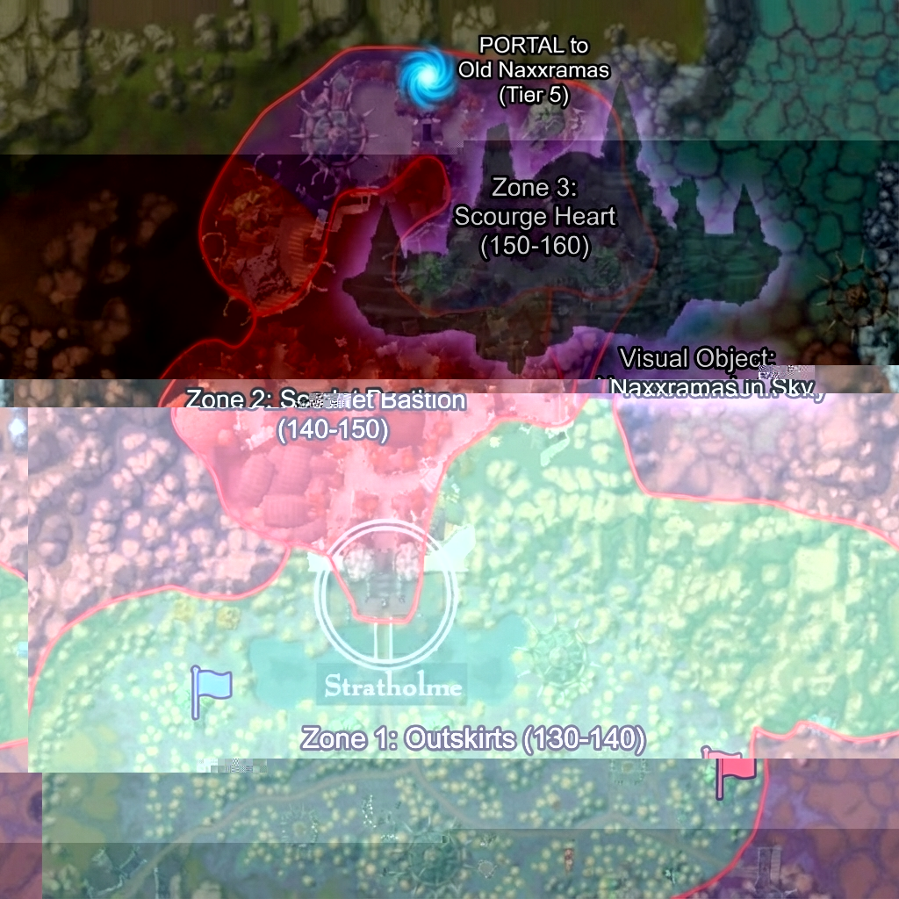
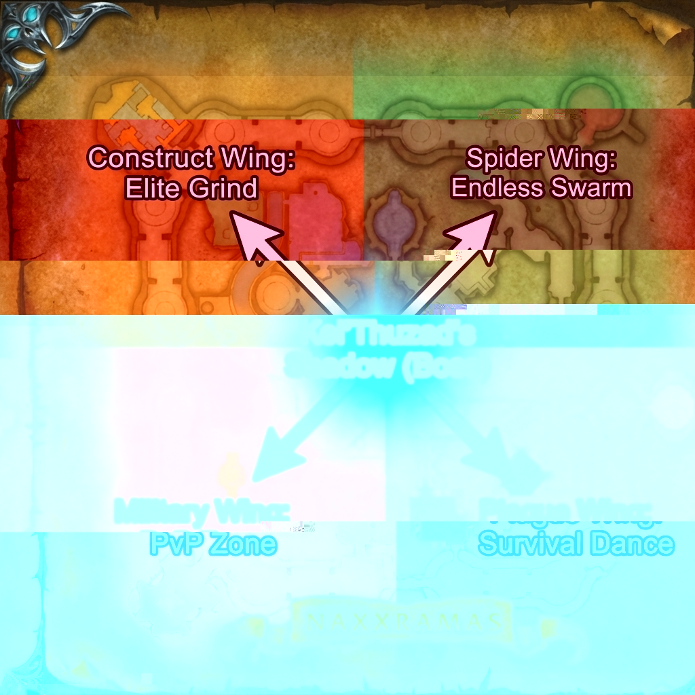

# Stratholme Leveling Zone Evaluation
## Level 130-160 | DC-WoW AzerothCore 3.3.5a

> [!NOTE]
> This is an **evaluation document**. Content is designed for AzerothCore 3.3.5a compatibility.

---

## Table of Contents
1. [Zone Concept Map](#zone-concept-map)
2. [Total Content Summary](#total-content-summary)
3. [Zone Overview](#zone-overview)
4. [Leveling Zones (3 Areas)](#leveling-zones-3-areas)
4. [Event Area (Endgame)](#event-area-endgame)
5. [NPCs & Rares](#npcs--rares)
6. [World Bosses](#world-bosses)
7. [Faction Bases](#faction-bases)

---

## Zone Concept Map

**Concept:** The leveling experience is split into 3 distinct geographic zones based on the user's markings.
*   **Zone 1:** The Outskirts (Level 130-140)
*   **Zone 2:** Scarlet Bastion (Level 140-150)
*   **Zone 3:** Scourge Heart (Level 150-160)

---
## Total Content Summary
| Category | Count | Notes |
|----------|-------|-------|
| **Leveling Enemies** | **50** | 12-14 per tier. |
| **Zone Rares** | **10** | Unique mechanics/loot. |
| **World Bosses** | **3** | Ramstein, Highlord, Culling Horror. |
| **Faction NPCs** | **18** | Questgivers, Vendors, Guards. |
| **Naxxramas Event** | **25** | 6 per wing + 1 Boss. |
| **Total NPCs** | **~106** | *Ready for SQL Implementation.* |

---

## Technical Appendix: Naxxramas Map Cloning (Option 1 Guide)

*If you choose to implement a FULL separate Map 999 instead of the Hybrid approach, here are the required steps.*

### 1. Client-Side Modifications (MPQ Patching)
A custom patch (`Patch-4.mpq`) is required for players to see the new map.
1.  **Map.dbc:** Create a new row for `MapID 999`.
    *   `Directory`: "NaxxramasClone"
    *   `InstanceType`: 1 (Instance)
    *   `MapName`: "The Fallen Citadel"
    *   `Expansion`: 2 (WotLK)
2.  **Map Files:** Copy `World\Maps\Naxxramas` to `World\Maps\NaxxramasClone` inside the MPQ.
    *   *Note:* You must hex-edit the `.wdt` file to point to the new folder name if the internal naming requires it, though usually DBC handles the directory link.

### 2. Server-Side Setup (AzerothCore)
1.  **DBC Extraction:** Run the server extractor on your modified client to generate the new `Map.dbc` for the server `data/dbc` folder.
2.  **Maps/VMaps/MMaps:**
    *   Copy the `maps/533` folder to `maps/999`.
    *   Copy `vmaps/533` to `vmaps/999`.
    *   Copy `mmaps/533` to `mmaps/999`.
3.  **Database:**
    *   No SQL entry needed for the map itself (handled by DBC).
    *   You must create `instance_template` entry for Map 999 to link scripts.

### 3. Pros/Cons Verification
*   **Result:** A fully independent map instance where you can spawn objects without affecting the original raid.
*   **Cost:** **Requires every player to download a patch.** For this leveling zone project, **Option 3 (Hybrid)** is still verified as superior for accessibility.

---

**Goal:** Create a seamlessly integrated "Old Naxxramas" event area.
**Recommendation:** **Hybrid Approach (Option 3)**.

| Option | Method | Pros | Cons |
|--------|--------|------|------|
| **1. Map Copy** | Clone Map 533 to Map 999. | Total control, independent. | **Requires Client Patch** (DBC + Map files). Complex for users. |
| **2. Object Placement** | Spawn Naxx WMO in Stratholme. | Seamless visual in sky. | **Interior Logic Missing.** WMOs don't have map geometry/collision for wings. |
| **3. Hybrid (Recommended)** | **Visuals:** Spawn Naxx Object in Sky (Stratholme). **Gameplay:** Teleport to Map 533 (Scripted Instance). | Best visual + Best gameplay. No client patch needed. | Visual object is just "show". |

**Plan:** We will proceed with **Option 3**.
1.  **Visual:** Attempt to spawn the *Decor* Naxxramas object in the sky of Zone 3 (if WMO exists/is spawnable).
2.  **Gameplay:** The "Portal" teleports players to **Map 533** (The actual dungeon map), but scripted as an open-world zone with respawns.

---

## Event Area: "The Descended Necropolis"
*Tier 5 (Level 160+) | Open World Event Zone (Map 533)*

A non-instanced, high-level grinding and PvP zone. Players teleport here from **Zone 3**.
**Corruption Mechanic:** Stacks build 2x faster here.

### Spider Wing: "The Endless Swarm" (Green)
*Theme: AoE Grinding. Hundreds of low-hp mobs.*

| Entry | Name | Level | Display ID | Flavor |
|-------|------|-------|------------|--------|
| 410600 | **Crypt Swarmer** | 160 | 15978 (Spider) | *Spawns in packs of 10.* |
| 410601 | **Venom Stalker** | 161 | 15979 (Nerubian) | *Roots players in webs.* |
| 410602 | **Carrion Feeder** | 160 | 16006 (Beetle) | *Explodes on death.* |
| 410603 | **Dread Creeper** | 160 | 12229 (Spider) | *Slows attack speed.* |
| 410604 | **Naxxramas Acolyte** | 161 | 16541 (Cultist) | *Heals spiders.* |
| 410605 | **Grand Widow's Pet** (Rare) | 162 | 1598 (Giant Spider) | *Can be tamed by Hunters?* |

### Construct Wing: "The Titan Challenge" (Orange)
*Theme: Single-Target DPS & Tanking. High HP Elites.*

| Entry | Name | Level | Display ID | Flavor |
|-------|------|-------|------------|--------|
| 410700 | **Patchwork Horror** | 162 | 16019 (Abom) | *Mini-Patchwerks. Hits extremely hard.* |
| 410701 | **Slime Hulk** | 161 | 8555 (Slime) | *Splits into smaller slimes.* |
| 410702 | **Living Poison** | 161 | 16023 (Globe) | *Aura deals nature damage.* |
| 410703 | **Stitched Giant** | 162 | 16019 (Abom) | *Knockback punt.* |
| 410704 | **Mad Scientist** | 161 | 16029 (Gnome) | *Throws potions.* |
| 410705 | **Thaddius's Spark** (Rare) | 163 | 16560 (Tesla) | *Chains lightning to near players.* |

### Military Wing: "Death Knight Arena" (Red)
*Theme: PvP & Tactical Combat. Humanoid NPCs use class skills.*

| Entry | Name | Level | Display ID | Flavor |
|-------|------|-------|------------|--------|
| 410800 | **Deathlord Trainee** | 161 | 16531 (DK) | *Uses Death Grip and Icy Touch.* |
| 410801 | **Skeletal Warhorse** | 160 | 16537 (Horse) | *Charges players.* |
| 410802 | **Necrotic Acolyte** | 161 | 16541 (Cultist) | *Heals the Death Knights.* |
| 410803 | **Risen Commander** | 162 | 16533 (Captain) | *Battle Shout buff.* |
| 410804 | **Spectral Archer** | 161 | 16535 (Archer) | *Ranged silence shot.* |
| 410805 | **The Four Horsemen's Squire** (Rare) | 163 | 16553 (DK) | *Drops PvP currency.* |

### Plague Wing: "The Safety Dance" (Purple)
*Theme: Survival. Environmental hazards active globally.*

| Entry | Name | Level | Display ID | Flavor |
|-------|------|-------|------------|--------|
| 410900 | **Plague Cauldron** | 160 | 16565 (Object) | *Spawns ghouls until destroyed.* |
| 410901 | **Mutated Grub** | 160 | 16572 (Larva) | *Slows movement speed.* |
| 410902 | **Fungal Giant** | 162 | 16577 (Giant) | *Knockbacks into poison clouds.* |
| 410903 | **Plague Bat** | 161 | 16568 (Bat) | *Airborne poison DoT.* |
| 410904 | **Rotting Slime** | 160 | 16570 (Slime) | *Leaves acid patch on death.* |
| 410905 | **Loatheb's Spore** (Rare) | 163 | 16584 (Spore) | *Grants 50% Crit buff on kill.* |

### Central Boss: Kel'Thuzad's Shadow
*Located in the center (Frostwyrm Lair entrance).*
*   **Summon Requirement:** Collect 4 **Wing Fragments** (1 from each wing's mobs).
*   **Fight Mechanics:**
    1.  **Phase 1:** Summons adds from all 4 wings simultaneously.
    2.  **Phase 2:** Casts "Frost Blast" (Melee must spread).
    3.  **Phase 3:** "Phylactery Bound" (Requires DPS burn or he heals).
*   **Loot:** Tier 5 Armor Tokens, **[Reins of the Spectral Steed]** (Low drop).

---

## Special Features: Making it "Special"

### 1. Wing-Specific Environmental Hazards
*   **Feasibility:** Verified for AzerothCore 3.3.5a.
    *   **Announcements:** Handled via `SendZoneText` (Eluna).
    *   **Buffs:** "Kel'Thuzad's Command" - Map-wide script applies Spell ID 43637 (Enrage visual) + custom damage mod. No client patch needed if reusing existing spell visuals.
*   **Mechanic:**
    *   **Kel'Thuzad Yell:** *"Minions of the Scourge, shred their flesh!"*
    *   **Effect:** All mobs in the active wing gain **+25% Atk Speed** and **Size +10%**.
    *   **Spider Wing:** **"Sticky Webs"** - If you stand still for >10s, you are wrapped in webs (Stunned) and must be freed by damage or an ally.
    *   **Plague Wing:** **"Global Safety Dance"** - Every 5 minutes, a zone-wide emote warns generally. 10 seconds later, slime erupts from the floor pattern. Safe zones rotate.
    *   **Military Wing:** **"Spectral Bombardment"** - Red target circles appear randomly on the ground. Mortars land after 3s dealing massive damage.
    *   **Construct Wing:** **"Static Charge"** - Players gain a charge. If they stand within 5 yards of another player, they arc lightning (Nature Dmg).

### 2. PvP Mechanic: "The Eye of Naxxramas"
*   **Trigger:** A rare object spawns in the center of a random wing.
*   **Mechanic:** A player picks it up.
*   **Effect:** The holder gains **+100% Damage** and **+200% Loot Drop Rate**, but cannot mount or stealth. Their location is marked on the map for all players.
*   **Goal:** Survive as long as possible to farm. If killed, the killer can loot the Eye.

### 3. Currency System: "Necrotic Runes"
*   **Source:** Drops from all mobs in the Event Zone.
*   **Spend:** Vendor in Zone 3 (Scourge Heart).
*   **Rewards:**
    *   **"Undying" Transmog Sets:** Replicas of vanished Classic Naxxramas gear (Tier 3).
    *   **Consumables:** "Ghoul Salve" (Cleanses Corruption stacks), "Rune of Teleportation" (Instant teleport to Naxx center).

---

## Special Feature Idea: "The Corruption System"

**Concept:** A zone-wide debuff mechanic ("Sanity") to replicate the horror of the Plaguelands.

*   **Mechanic:** Staying in **Zone 2** or **Zone 3** (and Naxxramas) applies "Creeping Corruption" stacks every minute.
*   **Effects:**
    *   **20 Stacks:** Screen turns slightly green, creepy whispers played.
    *   **50 Stacks:** Movement speed reduced by 10%, damage taken increased by 5%.
    *   **100 Stacks:** Player becomes **Mind Controlled** (Hostile to faction) for 60 seconds, then dies.
*   **Cleansing:**
    *   Must return to a **Faction Base** (Alliance/Horde/Neutral) to reset stacks.
    *   Use "Purifying Bonfires" scattered in the zone (Rare interactable objects).
*   **Reward:** Surviving at high stacks grants increased XP/Reputation ("Risk vs Reward").

---

## NPCs & Rares

### Notable NPCs
| Entry | Name | Zone | Flavor |
|-------|------|------|--------|
| 410100 | **Gatekeeper Xy'lor** | Zone 1 | *"None pass without tribute."* |
| 410120 | **Grand Inquisitor Isillien (Ghost)** | Zone 2 | *"The fire cleanses all!"* |
| 410150 | **Baron Rivendare's Husk** | Zone 3 | *"My horse... where is my horse?"* |

### Rares (Samples)
*   **Zone 1:** *The Mud-Stalker* (Giant Plague Rat)
*   **Zone 2:** *The Unforgiven Light* (Corrupted Wisp)
*   **Zone 3:** *Stitches Jr.* (Mini-abomination)

---

## World Bosses

### 1. **Ramstein the Reborn** (Weekly)
*   **Location:** Zone 3 (Slaughter Square)
*   **Mechanic:** Phased 25-man fight. "Belly Beast" phase.

### 2. **The Scarlet Highlord** (Bi-Weekly)
*   **Location:** Zone 2 (Bastion Cathedral)
*   **Mechanic:** "Holy Fire" that burns mana.

---

## Faction Bases

*   **Alliance:** "Forward Camp Alpha" (Zone 1 - West Side)
*   **Horde:** "Forward Camp Bravo" (Zone 1 - East Side)
*   **Neutral:** "Argent Crossroads" (Zone 1 - Central Gate)

> [!TIP]
> This 3-zone layout offers a clearer progression path (Outside -> West -> North) and saves the Event Area (Naxx) as a distinct endgame reward.
